# 回测 API 收敛迭代计划

## 目标

将当前 4 条回测 API 路径收敛为 `tqsdk` facade 层的统一入口，保持 Python SDK 的 "一个入口 + 正交参数 + 策略 body 零分支" 设计哲学。内部 `tqsdk-wait` / `tqsdk-task` 分层保留不动。

## 当前基线

```
tqsdk::Tq           — 只有 Tq::futures() → TqBuilder → .connect()
tqsdk::TqBuilder    — 只有 live futures 支持，无 backtest/local_backtest
```

## 收敛后目标 API

```rust
// ── 实盘 (已有) ──
let mut tq = Tq::futures().auth_env()?.trade_target_tqkq().connect().await?;

// ── 服务端回测 (Phase 1) ──
let mut tq = Tq::futures()
    .auth_env()?
    .backtest(start_ns, end_ns)        // ← 新增
    .connect().await?;

// ── 本地离线回测 (Phase 2) ──
let cache = MarketCacheReplay::new(events);
let mut tq = Tq::futures()
    .auth_env()?
    .local_backtest(cache)             // ← 新增
    .connect().await?;

// ── 策略 body：三种模式完全一致 ──
let quote = tq.quote("SHFE.rb2501").await?;
while tq.next().await? {
    let snap = quote.load()?;
    // ...
}
```

---

## Phase 1: 服务端回测 — `TqBuilder::backtest()`

> **风险**: 低 — 只在 facade 层做薄转发  
> **价值**: 高 — 立即对齐 Python `TqApi(backtest=TqBacktest(...))` 最常用路径

### 改动范围

#### [MODIFY] [lib.rs](file:///Users/joeslee/Projects/GitHub/tqsdk-rust/crates/tqsdk/src/lib.rs)

1. `TqBuilder` 新增字段和方法：

```rust
pub struct TqBuilder {
    auth: Option<Auth>,
    query_enabled: bool,
    trade_targets: Vec<TradeTarget>,
    market_mode: MarketMode,            // ← 新增
    backtest: Option<BacktestConfig>,   // ← 新增
}

enum MarketMode {
    FuturesLive,     // 默认
    StockLive,
}

enum BacktestConfig {
    Server { start_ns: i64, end_ns: i64 },
}
```

2. 新增 builder methods：

```rust
impl TqBuilder {
    /// 进入服务端回测模式（≈ Python TqBacktest）
    pub fn backtest(mut self, start_ns: i64, end_ns: i64) -> Self {
        self.backtest = Some(BacktestConfig::Server { start_ns, end_ns });
        self
    }

    /// 切换到股票市场
    pub fn stock(mut self) -> Self {
        self.market_mode = MarketMode::StockLive;
        self
    }
}
```

3. 修改 `connect()` 方法：

```rust
pub async fn connect(self) -> Result<Tq> {
    let auth = self.auth.ok_or(Error::MissingAuth)?;
    let mut wait_builder = tqsdk_wait::TqApiBuilder::new(auth.user, auth.pass);

    // 设置市场和回测模式
    wait_builder = match (&self.market_mode, &self.backtest) {
        (MarketMode::FuturesLive, None) => wait_builder.futures_market(),
        (MarketMode::StockLive, None) => wait_builder.stock_market(),
        (MarketMode::FuturesLive, Some(BacktestConfig::Server { start_ns, end_ns })) =>
            wait_builder.futures_backtest(*start_ns, *end_ns)?,
        (MarketMode::StockLive, Some(BacktestConfig::Server { start_ns, end_ns })) =>
            wait_builder.stock_backtest(*start_ns, *end_ns)?,
    };

    // ... trade targets, query 等不变 ...
    let api = wait_builder.build().await?;
    Ok(Tq::from_api(api))
}
```

4. `Tq::futures()` 改为 `Tq::new()`，保留 `futures()` 做向后兼容别名：

```rust
impl Tq {
    pub fn new() -> TqBuilder { TqBuilder::new() }
    pub fn futures() -> TqBuilder { TqBuilder::new() }  // 别名
}
```

#### [NEW] [api_contract_s37_facade_server_backtest.rs](file:///Users/joeslee/Projects/GitHub/tqsdk-rust/crates/tqsdk/examples/api_contract_s37_facade_server_backtest.rs)

```rust
//! Scenario: facade 层服务端回测
//! 与实盘代码只差一行 .backtest(start, end)

let mut tq = Tq::futures()
    .auth_env()?
    .backtest(start_ns, end_ns)
    .connect().await?;

let quote = tq.quote("SHFE.au2602").await?;
while tq.next().await? {
    let snap = quote.load()?;
    println!("{} {}", snap.datetime, snap.last_price);
}
```

### 验证

```bash
cargo check --workspace --examples
cargo test --workspace
cargo clippy --workspace --examples --all-targets -- -D warnings
```

---

## Phase 2: 本地离线回测 — `TqBuilder::local_backtest()`

> **风险**: 中 — 需要在 `Tq` 中引入 enum 区分 wait-driven 和 task-driven 内核  
> **依赖**: Phase 1 完成

### 设计决策

> [!IMPORTANT]
> **核心问题**：`Tq` 当前包装 `TaskHost`（内部持有 `TqApi`）。本地回测需要用
> `StrategyBacktest`（内部持有 `StrategyHost` + `TqSim`），二者的推进语义不同。
>
> **方案 A**：`Tq` 内部变为 enum — `Tq { Live(TaskHost), LocalBacktest(StrategyBacktest) }`  
> **方案 B**：本地回测走独立入口 `TqLocalBacktest` — 不进入 `Tq`
>
> **建议选择方案 A**，因为用户目标是同一 `Tq` 类型、同一 `next()`/`quote()` 接口，
> live/backtest body 零分支。方案 B 退化回当前多路径问题。

### 改动范围

#### [MODIFY] [lib.rs](file:///Users/joeslee/Projects/GitHub/tqsdk-rust/crates/tqsdk/src/lib.rs)

1. `Tq` 内部引入 enum：

```rust
pub struct Tq {
    inner: TqInner,
}

enum TqInner {
    Live(tqsdk_task::TaskHost),
    LocalBacktest(LocalBacktestDriver),
}

struct LocalBacktestDriver {
    backtest: tqsdk_task::StrategyBacktest,
    // 代理 quote/account/position 读取
}
```

2. `BacktestConfig` 扩展：

```rust
enum BacktestConfig {
    Server { start_ns: i64, end_ns: i64 },
    Local { replay: tqsdk_data::MarketCacheReplay },
}
```

3. 新增 builder methods：

```rust
impl TqBuilder {
    /// 本地离线回测，使用 TqSim Python 兼容撮合
    pub fn local_backtest(mut self, replay: tqsdk_data::MarketCacheReplay) -> Self {
        self.backtest = Some(BacktestConfig::Local { replay });
        self
    }
}
```

4. `connect()` 路由到 `StrategyBacktest::builder()`:

```rust
// Local backtest 分支
(_, Some(BacktestConfig::Local { replay })) => {
    let mut builder = StrategyBacktest::builder(replay)
        .sim(TqSim::new());
    for symbol in &self.quote_symbols {
        builder = builder.quote(symbol);
    }
    let backtest = builder.build().await?;
    return Ok(Tq { inner: TqInner::LocalBacktest(LocalBacktestDriver { backtest }) });
}
```

5. `Tq::next()` 统一语义：

```rust
impl Tq {
    pub async fn next(&mut self) -> Result<bool> {
        match &mut self.inner {
            TqInner::Live(host) => host.wait_update(None).await.map_err(Error::from),
            TqInner::LocalBacktest(driver) => {
                match driver.backtest.next().await? {
                    Some(_ctx) => Ok(true),
                    None => Ok(false),
                }
            }
        }
    }
}
```

6. `Tq` 新增 `quote_symbol()` builder 支持（本地回测需要预声明 symbols）：

```rust
impl TqBuilder {
    pub fn quote_symbol(mut self, symbol: impl Into<String>) -> Self {
        self.quote_symbols.push(symbol.into());
        self
    }
    pub fn price_tick(mut self, symbol: impl Into<String>, tick: f64) -> Self {
        self.price_ticks.insert(symbol.into(), tick);
        self
    }
}
```

#### [NEW] [api_contract_s38_facade_local_backtest.rs](file:///Users/joeslee/Projects/GitHub/tqsdk-rust/crates/tqsdk/examples/api_contract_s38_facade_local_backtest.rs)

```rust
//! Scenario: facade 层本地离线回测
//! 用户体验：只改 builder 配置，策略 body 不变

let replay = MarketCacheReplay::new(events);
let mut tq = Tq::new()
    .auth_env()?                    // 本地回测仍需 auth（metadata query）
    .local_backtest(replay)
    .quote_symbol("SHFE.rb2501")
    .price_tick("SHFE.rb2501", 1.0)
    .connect().await?;

let quote = tq.quote("SHFE.rb2501").await?;
while tq.next().await? {
    let snap = quote.load()?;
    // ... 与实盘策略完全一致
}
```

### 验证

```bash
cargo check --workspace --examples
cargo test --workspace
cargo clippy --workspace --examples --all-targets -- -D warnings
```

---

## Phase 3: `Tq` 读取面统一

> **风险**: 中 — 需要确保 LocalBacktest 驱动下 `quote()`/`account()`/`position()` 的读取路径一致  
> **依赖**: Phase 2 完成

### 改动范围

#### [MODIFY] [lib.rs](file:///Users/joeslee/Projects/GitHub/tqsdk-rust/crates/tqsdk/src/lib.rs)

`Tq` 的每个公开读取方法都需要 match 分发：

```rust
impl Tq {
    pub async fn quote(&mut self, symbol: &str) -> Result<QuoteRef> {
        match &mut self.inner {
            TqInner::Live(host) => host.api_mut().quote(symbol).await.map_err(Error::from),
            TqInner::LocalBacktest(driver) => {
                // LocalBacktest 通过 StrategyBacktest 的内部 StrategyHost
                // 间接访问同一 runtime reader
                driver.quote(symbol).map_err(Error::from)
            }
        }
    }

    pub fn account(&self, account_id: &str) -> AccountRef { ... }
    pub fn position(&self, account_id: &str, symbol: &str) -> PositionRef { ... }
}
```

> [!WARNING]
> **关键约束**：`StrategyBacktest` 内部的 `StrategyHost` 持有 `TaskHost`，
> `TaskHost` 又持有 `TqApi`。理论上可以通过 `backtest.strategy().task_host().api()`
> 拿到同一 `TqApi`。但 `StrategyBacktestContext` 是借用型生命周期 (`'a`)，
> 需要确认在 `next()` 返回后 context 被释放前，quote/account/position 的读取是否安全。
>
> 如果生命周期冲突，可能需要在 `LocalBacktestDriver` 中缓存最新的读取快照，
> 而不是直接代理到 `StrategyBacktestContext`。

### 备选方案：Phase 3 的简化路径

如果 `StrategyBacktest` 的借用模式太复杂，可以降级为：

- `Tq::next()` 在本地回测模式下把 `StrategyBacktestContext` 的快照 cache 到 `LocalBacktestDriver`
- `Tq::quote()` 在本地回测模式下返回 cached 快照的 `QuoteRef`
- 代价：多一次 clone，但用户体验一致

---

## Phase 4: Prelude 与 re-export 更新

> **风险**: 低  
> **依赖**: Phase 1 完成即可开始

### 改动范围

#### [MODIFY] [lib.rs](file:///Users/joeslee/Projects/GitHub/tqsdk-rust/crates/tqsdk/src/lib.rs)

1. prelude 更新：

```rust
pub mod prelude {
    pub use crate::{Error, Result, TargetPos, Tq, TqBuilder};
    pub use tqsdk_wait::{AccountRef, PositionRef, QuoteRef, QuoteSet, WaitStep};
}
```

已有的 prelude 不需要改动，因为 `Tq` 和 `TqBuilder` 已在其中。

2. `advanced` 模块补充回测类型 re-export（给高级用户）：

```rust
pub mod advanced {
    pub mod task {
        pub use tqsdk_task::{
            // ... 已有 ...
            StrategyBacktest, StrategyBacktestBuilder, StrategyBacktestSummary,
            StrategyReplay, StrategyReplayBuilder, StrategyReplaySpeed,
            StrategyReplayCheckpoint, StrategyReplayCheckpointStore,
            StrategyDeployment, StrategyDeploymentConfig,
            StrategyEnvironment, StrategySupervisor,
            TqSim,
        };
    }

    pub mod data {
        pub type DataClient = tqsdk_data::DataClient;
        pub type DataError = tqsdk_data::DataError;
        pub type MarketCacheReplay = tqsdk_data::MarketCacheReplay;  // ← 新增
        pub type MarketCacheEvent = tqsdk_data::MarketCacheEvent;    // ← 新增
    }
}
```

3. 在 crate 根也 re-export `MarketCacheReplay`（本地回测需要）：

```rust
// lib.rs 顶层
pub use tqsdk_data::MarketCacheReplay;
```

---

## Phase 5: API Contract Examples

> **依赖**: Phase 1-3 完成

### 新增 examples

| 文件 | 场景 | 验证点 |
|------|------|--------|
| `api_contract_s37_facade_server_backtest.rs` | 服务端回测 | `.backtest()` 一行切换 |
| `api_contract_s38_facade_local_backtest.rs` | 本地离线回测 | `.local_backtest()` + `TqSim` 撮合 |
| `api_contract_s39_facade_live_backtest_same_body.rs` | **同一 fn 接受 `&mut Tq`** | live/backtest body 零分支 |

`s39` 的核心验证：

```rust
async fn run_strategy(tq: &mut Tq, symbol: &str) -> tqsdk::Result<()> {
    let quote = tq.quote(symbol).await?;
    while tq.next().await? {
        let snap = quote.load()?;
        println!("{} {}", snap.datetime, snap.last_price);
    }
    Ok(())
}

// live 和 backtest 用同一个 fn
run_strategy(&mut tq_live, "SHFE.au2602").await?;
run_strategy(&mut tq_backtest, "SHFE.au2602").await?;
```

### 验证

```bash
cargo check --workspace --examples
cargo test --workspace
cargo clippy --workspace --examples --all-targets -- -D warnings
```

---

## Phase 6: 文档与架构更新

> **依赖**: Phase 1-5 完成

### 改动文件

| 文件 | 更新内容 |
|------|---------|
| [README.md](file:///Users/joeslee/Projects/GitHub/tqsdk-rust/README.md) | 新增回测示例，标注推荐路径 |
| [crates/tqsdk/README.md](file:///Users/joeslee/Projects/GitHub/tqsdk-rust/crates/tqsdk/README.md) | facade crate 回测 API 文档 |
| [docs/architecture/api-task.md](file:///Users/joeslee/Projects/GitHub/tqsdk-rust/docs/architecture/api-task.md) | 标注 StrategyReplay/StrategyBacktest 为内部实现层 |
| [docs/architecture/crate-blueprint.md](file:///Users/joeslee/Projects/GitHub/tqsdk-rust/docs/architecture/crate-blueprint.md) | 更新 tqsdk-backtest 规划 |
| [AGENTS.md](file:///Users/joeslee/Projects/GitHub/tqsdk-rust/AGENTS.md) | 如有架构约束变化则更新 |

---

## 迭代时序图

```mermaid
gantt
    title 回测 API 收敛迭代计划
    dateFormat X
    axisFormat %s

    section Phase 1
    TqBuilder::backtest()           :p1, 0, 1
    api_contract_s37 example        :p1e, 0, 1
    验证                             :p1v, 1, 2

    section Phase 2
    TqInner enum                    :p2a, 2, 3
    TqBuilder::local_backtest()     :p2b, 3, 4
    connect() 路由                   :p2c, 4, 5
    api_contract_s38 example        :p2e, 5, 6
    验证                             :p2v, 6, 7

    section Phase 3
    Tq 读取面统一                     :p3, 7, 9
    验证                             :p3v, 9, 10

    section Phase 4
    Prelude + re-export             :p4, 2, 3

    section Phase 5
    api_contract_s39 same body      :p5, 10, 11
    验证                             :p5v, 11, 12

    section Phase 6
    文档更新                          :p6, 12, 13
```



---

## 风险与开放问题

### 需要确认的设计决策

> [!IMPORTANT]
> **Q1: `Tq` 内部用 enum 还是 trait object？**
>
> 建议 enum。当前只有两个变体（Live / LocalBacktest），enum dispatch 零开销且编译期可检查。
> 如果未来出现第三种（如 StrategyReplay without TqSim），再评估是否重构。

> [!IMPORTANT]
> **Q2: 本地回测的 `Tq::quote()` 返回 `QuoteRef` 还是新类型？**
>
> 建议返回同一 `QuoteRef`。`StrategyBacktest` 内部复用了 `StrategyHost` → `TaskHost` → `TqApi`，
> 理论上可以拿到同一 `RuntimeReader`。需要验证 `StrategyBacktest::next()` 的借用是否允许
> 在同一轮中读取 quote。

> [!IMPORTANT]
> **Q3: 本地回测是否需要 auth？**
>
> 当前 `StrategyBacktest` 通过 `StrategyTestHarness` 创建，不需要 auth 也不需要网络。
> 如果用户的 `MarketCacheReplay` 数据来自 `DataClient`（需要 auth），那 auth 在数据获取阶段就已完成。
> 建议：`local_backtest()` 模式下 auth 可选，如果未提供则跳过 session 创建。

> [!WARNING]
> **Q4: TargetPosTask 在 local_backtest 模式下是否可用？**
>
> `TargetPosTask` 依赖 `TaskHost`，而 `StrategyBacktest` 内部有 `StrategyHost`
> （包含 `TaskHost`）。理论上可行，但需要确认 `TqSim` 撮合 + `TargetPosTask` 的交互。
> 建议 Phase 2 先不暴露 `target_pos()`，Phase 3 验证后再开放。

### 不变量

- `tqsdk-wait` / `tqsdk-task` 的现有 public API 不删除、不破坏
- 高级用户仍可直接依赖 `tqsdk-task` 使用 `StrategyReplay` / `StrategyDeployment`
- 路径④（Deployment/Supervisor）不进入 facade 的 simple API

### 验证命令

每个 Phase 完成后：

```bash
cargo fmt --all --check
cargo check --workspace --examples
cargo test --workspace
cargo clippy --workspace --examples --all-targets -- -D warnings
```
