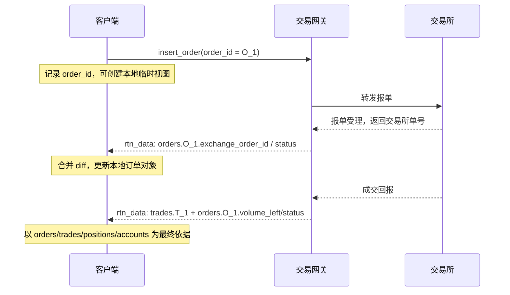

# 天勤 DIFF 协议实现指南

本文面向需要自行实现 DIFF 客户端的开发者。文档只描述协议、数据语义和客户端实现要点，不依赖任何特定编程语言或 SDK。

DIFF（Differential Information Flow for Finance）是基于 WebSocket 和 JSON 的增量数据同步协议。服务端维护一棵完整的业务信息截面，客户端维护该截面的本地镜像；服务端只推送变化部分，客户端按约定合并后得到最新业务状态。行情网关、交易中继网关等服务可在同一协议框架下提供不同业务模块。

核心思想：

- 状态树同步：客户端本地维护一棵 JSON 数据树，业务逻辑读取本地树而不是逐包解释事件。
- 增量更新：服务端推送的是数据树变化片段，客户端按 diff 规则合并。
- 推拉结合流控：客户端通过 `peek_message` 表示已经准备好接收下一批 `rtn_data`，避免服务端无限推送导致客户端堆积。
- 统一下行信封：行情、交易、通知和错误状态通常都通过 `rtn_data.data` 中的数据树 diff 表达。

## 1. 基本概念

### 1.1 业务信息截面

业务信息截面是一棵 JSON 对象树，表示某一时刻的全部业务状态，例如行情报价、K 线序列、账户资金、持仓、委托、成交、通知等。

客户端不应把每个推送包当作孤立事件处理，而应将其合并到本地数据树。业务代码读取本地数据树即可得到当前状态。

### 1.2 diff

diff 是服务端对业务信息截面的增量更新，语义接近 JSON Merge Patch：

- 对象字段表示要更新的数据路径。
- `null` 表示删除字段或节点。
- 对象表示递归合并。
- 标量和数组表示覆盖旧值。

### 1.3 aid

每个 WebSocket JSON 包都有 `aid` 字段，用来标识包类型。

- `rtn_data`：服务端向客户端推送业务数据更新。
- `peek_message`：客户端向服务端请求下一次业务数据更新。
- 其他 `aid`：客户端向服务端发送的业务指令，例如订阅行情、订阅图表数据、登录、下单、撤单等。

### 1.4 兼容性原则

客户端实现必须满足以下兼容性原则：

- 对未知字段应合并保存或忽略读取，不应报错。
- 对同一字段的类型变化应按业务文档处理。例如部分价格字段在未产生有效值前可能不是普通数值。
- 不应假设某几个字段一定在同一个 diff 中更新。
- 不应假设没有变化的字段一定不会再次发送。
- `null` 在 diff 中具有删除语义，不应当作普通业务值使用。
- 对缺失价格、未结算价格等“暂无有效值”的场景，应按具体网关约定处理。部分实现可能使用字符串哨兵值或非标准数值哨兵值；严格 JSON 客户端需要在接入前确认网关实际编码方式。

## 2. 传输层

DIFF 使用 WebSocket 传输 JSON 对象。标准连接通常是 `ws://` 或 `wss://`；部分客户端或网关也可能提供 `sm://`、`zq://` 等封装方案，这类方案属于建连适配层，连接建立后的消息仍按本章的 WebSocket JSON 包处理。

| 项目 | 说明 |
| --- | --- |
| 连接方式 | WebSocket。生产环境通常使用 `wss://`。 |
| 编码 | 每个 WebSocket 文本消息是一段 JSON 对象。 |
| 安全 | 可使用 TLS/SSL。 |
| 压缩 | 可使用 WebSocket `permessage-deflate`。 |
| 通信模式 | 全双工。任一方可随时发送消息。 |
| 包顺序 | 同一 WebSocket 连接内按 WebSocket 消息顺序处理。 |
| 响应模型 | 客户端指令通常不要求同步响应，处理结果通过后续 `rtn_data` 反映到业务信息截面。 |

客户端发送指令后，不应等待一个同名响应包。应继续通过 `peek_message` 拉取更新，并观察数据树中对应字段是否变化。

## 3. 消息包格式

### 3.1 通用包结构

```json
{
  "aid": "message_type"
}
```

`aid` 必须是字符串。不同 `aid` 允许携带不同业务字段。

### 3.2 服务端到客户端：`rtn_data`

`rtn_data` 是服务端到客户端的标准业务数据更新包。连接状态通知、错误通知等也可以作为 `notify` 节点放在 `rtn_data.data` 的 diff 中下发。

```json
{
  "aid": "rtn_data",
  "data": [
    {
      "quotes": {
        "SHFE.cu2401": {
          "datetime": "2026-06-17 10:15:00.500000",
          "last_price": 78540,
          "volume": 123456
        }
      }
    },
    {
      "mdhis_more_data": false
    }
  ]
}
```

字段说明：

| 字段 | 类型 | 必填 | 说明 |
| --- | --- | --- | --- |
| `aid` | string | 是 | 固定为 `rtn_data`。 |
| `data` | array<object> | 是 | diff 数组。每个元素是一个 diff 对象。 |

推荐把 `data` 数组作为一个批次处理：按数组顺序合并每个 diff，但业务层最好在整个 `data` 数组合并完成后再读取业务状态。数组中间状态可能短暂不自洽。

### 3.3 客户端到服务端：`peek_message`

`peek_message` 用于请求服务端发送下一次业务信息截面更新。

```json
{
  "aid": "peek_message"
}
```

服务端收到后：

- 若已有更新，应尽快返回一个 `rtn_data`。
- 若暂无更新，可等待到有更新后再返回。
- 发送一个 `rtn_data` 后，可等待客户端下一次 `peek_message` 再发送后续更新。

简单客户端可以在连接成功后立即发送一次 `peek_message`，每处理完一个 `rtn_data` 后再发送下一次。

## 4. diff 合并规则

### 4.1 合并算法

语言无关伪代码：

```text
merge(target, patch):
  for each key, value in patch:
    if value is null:
      delete target[key] if it exists

    else if value is object:
      if target[key] is not object:
        target[key] = {}
      merge(target[key], value)

    else:
      target[key] = value
```

实现注意：

- 数组按标量处理，即整体替换，不做逐元素合并。
- `null` 删除对象节点时，应同步删除其子树。
- 只有显式 `null` 具有删除语义；不要因为一次递归合并后某个对象为空，就自动删除其父节点。
- 客户端可维护变更标记，用于判断某路径在本次 `rtn_data` 中是否发生真实变化。
- 如果需要判断“真实变化”，可在合并前比较旧值和新值，未变化字段不计入变更集合。
- 如果客户端为了默认值、类型安全或对象身份稳定而保留某些持久节点外壳，这是本地缓存策略，不应改变 wire-level diff 的含义。协议层仍以 `null` 作为删除信号。

### 4.2 示例：字段覆盖

初始状态：

```json
{
  "quotes": {
    "SHFE.cu2401": {
      "last_price": 78500,
      "volume": 100
    }
  }
}
```

diff：

```json
{
  "quotes": {
    "SHFE.cu2401": {
      "last_price": 78540
    }
  }
}
```

合并后：

```json
{
  "quotes": {
    "SHFE.cu2401": {
      "last_price": 78540,
      "volume": 100
    }
  }
}
```

### 4.3 示例：删除字段

diff：

```json
{
  "trade": {
    "account1": {
      "positions": {
        "SHFE.cu2401": null
      }
    }
  }
}
```

含义是删除 `trade.account1.positions.SHFE.cu2401` 这一持仓节点。

## 5. 推荐客户端主循环

客户端通常维护以下状态：

- `data_tree`：完整业务信息截面镜像。
- `pending_peek`：是否已经发送 `peek_message` 且尚未收到对应更新。
- `subscriptions`：当前希望保持的订阅请求，用于重连后恢复。
- `changed_paths`：本次 `rtn_data` 影响到的路径，供业务层判断变更。

主循环伪代码：

```text
连接 WebSocket
发送初始请求，例如 req_login / subscribe_quote / set_chart
发送 peek_message
pending_peek = true

while WebSocket 保持打开:
  packet = 接收并解析 JSON()

  if packet.aid == "rtn_data":
    changed_paths = 空集合
    for diff in packet.data:
      merge(data_tree, diff)
      记录 changed_paths

    pending_peek = false
    在整个 packet.data 合并完成后通知业务层

    if pending_peek == false:
      发送 peek_message
      pending_peek = true

  else:
    处理实现相关的其他包
```

不要同时堆积大量 `peek_message`。常见实现保持最多一个未完成的 `peek_message`，这样客户端处理慢时，服务端会自然降低推送频率。

## 6. 数据树结构

以下是面向行情、历史序列、交易和通知的通用数据树。实际服务端可以增加额外节点，客户端必须容忍。

```text
/
├── ins_list                              当前实时行情订阅列表，通常由服务端回显
├── mdhis_more_data                       历史行情初始化或分页是否还有更多数据
├── notify
│   └── {notify_id}                       通知对象
├── symbols
│   └── {query_id}                        合约查询结果
├── quotes
│   └── {symbol}                          Quote 对象
├── trading_status
│   └── {symbol}                          TradingStatus 对象
├── charts
│   └── {chart_id}                        Chart 状态
├── klines
│   └── {symbol}
│       └── {duration_nano}
│           ├── last_id                   该序列最新记录 id
│           ├── data
│           │   └── {id}                  Kline 对象
│           └── binding
│               └── {other_symbol}
│                   └── {main_id}         主合约 id 对应的副合约 id
├── ticks
│   └── {symbol}
│       ├── last_id                       该序列最新记录 id
│       └── data
│           └── {id}                      Tick 对象
└── trade
    └── {account_key}
        ├── session                       登录会话/交易日状态
        ├── trade_more_data               交易截面是否还有更多初始化数据
        ├── accounts
        │   └── {currency}                资金账户对象
        ├── positions
        │   └── {symbol}                  持仓对象
        ├── orders
        │   └── {order_id}                委托对象
        ├── trades
        │   └── {trade_id}                成交对象
        ├── banks                         银行账户信息，若服务端支持银期转账
        ├── transfers                     转账记录，若服务端支持银期转账
        ├── pre_insert_orders             预下单估算结果，若服务端支持
        ├── his_settlements               历史结算单，若服务端支持
        ├── risk_management_rule          风控规则，若服务端支持
        └── risk_management_data          风控统计，若服务端支持
```

键名说明：

| 名称 | 说明 |
| --- | --- |
| `{symbol}` | 合约代码，通常为 `EXCHANGE.instrument`，例如 `SHFE.cu2401`。 |
| `{duration_nano}` | K 线周期，单位纳秒。Tick 序列使用 `duration = 0`，不放在 `klines` 下。 |
| `{chart_id}` | 客户端生成的图表订阅 id。相同 `chart_id` 的后续 `set_chart` 会覆盖前一次请求。 |
| `{account_key}` | 交易账户命名空间键。不同网关可使用登录用户、账户哈希或其他不透明字符串。客户端应把它当作 opaque key。 |

JSON 对象键都是字符串。`duration_nano`、K 线 id、Tick id 等逻辑上是整数，但作为对象 key 出现时应按字符串处理；客户端可以在本地访问层做统一转换。

## 7. 上行消息参考

本章列出客户端可能发送的 DIFF 消息。除特别说明外，服务端不会返回同名响应包；处理结果统一通过后续 `rtn_data.data` 中的数据树 diff 表达。

### 7.0 消息矩阵和响应路径

| `aid` | 方向 | 所属服务 | 必须字段 | 主要响应路径 | 完成条件 |
| --- | --- | --- | --- | --- | --- |
| `subscribe_quote` | 客户端 -> 服务端 | 行情 | `ins_list` | `ins_list`、`quotes.{symbol}`、`notify` | 根节点 `ins_list` 与请求一致；关注的 `quotes.{symbol}` 至少收到静态信息或行情字段。 |
| `set_chart` | 客户端 -> 服务端 | 行情 | `chart_id`、`ins_list`、`duration` | `charts.{chart_id}`、`klines`、`ticks`、`mdhis_more_data`、`notify` | 见 [10.2 图表初始化](#102-图表初始化)。核心条件是 `state` 匹配、`mdhis_more_data = false`；非空序列要求窗口定位和有效 `last_id`，空序列要求服务端显式回写空结果。 |
| `peek_message` | 客户端 -> 服务端 | 通用 | 无 | `rtn_data.data` | 收到一个 `rtn_data` 后，本次 peek 完成。 |
| `req_login` | 客户端 -> 服务端 | 交易 | 见 7.4 | `trade.{account_key}.session`、`trade.{account_key}.trade_more_data`、账户/持仓/委托/成交/通知 | `session.trading_day` 有效且 `trade_more_data = false`；失败时通常出现 `notify` 或会话不完整。 |
| `confirm_settlement` | 客户端 -> 服务端 | 交易 | 无 | `notify`、`trade.{account_key}.session` | 无统一业务字段；客户端应继续读取 `rtn_data`，以通知或后续交易数据为准。 |
| `ins_query` | 客户端 -> 服务端 | 合约/行情 | `query_id`、`query` | `symbols.{query_id}`、可选 `quotes.{symbol}`、`notify` | `symbols.{query_id}` 出现，且不再需要该查询时可发送空 `query` 释放。 |
| `subscribe_trading_status` | 客户端 -> 服务端 | 交易状态 | `ins_list` | `trading_status.{symbol}`、`notify` | 关注合约收到 `trading_status`。 |
| `insert_order` | 客户端 -> 服务端 | 交易 | 见 7.8 | `trade.{account_key}.orders.{order_id}`、`trades`、`positions`、`accounts`、`notify` | `orders.{order_id}` 出现；终态以 `status = FINISHED` 或 `is_dead = true` 判断。 |
| `pre_insert_order` | 客户端 -> 服务端 | 交易 | 见 7.9 | `trade.{account_key}.pre_insert_orders.{order_id}`、`notify` | 估算字段如 `pre_margin` 出现；清理请求可使用空 `instrument_id`。 |
| `cancel_order` | 客户端 -> 服务端 | 交易 | `order_id` | `trade.{account_key}.orders.{order_id}`、`notify` | 原订单进入终态或 `volume_left`/`last_msg` 更新；发送成功不等于撤单成功。 |
| `req_transfer` | 客户端 -> 服务端 | 交易 | 见 7.11 | `trade.{account_key}.transfers.{transfer_id}`、`accounts`、`notify` | 出现转账记录，或收到错误通知。 |
| `set_risk_management_rule` | 客户端 -> 服务端 | 交易 | 见 7.15 | `trade.{account_key}.risk_management_rule.{exchange_id}`、`notify` | 服务端回写规则字段覆盖请求字段。 |
| `qry_account_info` | 客户端 -> 服务端 | 交易 | 无 | `trade.{account_key}.accounts`、`positions`、`orders`、`trades`、`trade_more_data`、`notify` | `trade_more_data = false`；用于刷新账户截面。 |
| `qry_account_register` | 客户端 -> 服务端 | 交易 | 无 | `trade.{account_key}.banks`、`transfers`、`notify` | 银行登记信息出现，或收到通知。 |
| `qry_settlement_info` | 客户端 -> 服务端 | 交易 | `trading_day` | `trade.{account_key}.his_settlements.{trading_day}`、`notify` | 指定交易日的结算单节点出现。 |
| `set_chart_data` | 客户端 -> 服务端 | Web GUI 扩展 | `symbol`、`dur_nano`、`datas` | Web GUI 内部状态；标准行情/交易数据树无必然回写 | 无标准完成条件。 |
| `set_report_data` | 客户端 -> 服务端 | Web GUI 扩展 | `report_datas` | Web GUI 内部状态 | 无标准完成条件。 |
| `ratio` | 客户端 -> 服务端 | 回放扩展 | `speed` | 回放服务内部状态 | 无标准 `rtn_data` 响应。 |
| `heartbeat` | 客户端 -> 服务端 | 回放扩展 | 无 | 回放服务内部状态 | 无标准 `rtn_data` 响应。 |
| `terminate` | 客户端 -> 服务端 | 回放扩展 | 无 | 回放会话关闭 | HTTP/会话层成功即可，不属于核心 WebSocket DIFF。 |

实现者应把上表中的响应路径当作“可能变化的路径集合”，不要假设一次请求只改变这些路径。例如下单成交可能同时更新订单、成交、持仓、资金和风控统计。

### 7.1 `subscribe_quote`：订阅实时行情

```json
{
  "aid": "subscribe_quote",
  "ins_list": "SHFE.cu2401,CFFEX.IF2406"
}
```

字段：

| 字段 | 类型 | 必填 | 说明 |
| --- | --- | --- | --- |
| `aid` | string | 是 | 固定为 `subscribe_quote`。 |
| `ins_list` | string | 是 | 逗号分隔的合约列表。 |

语义：

- 每次发送时应列出当前全部需要订阅的合约。
- 后一次订阅列表覆盖前一次订阅列表。
- 合约代码大小写敏感，通常必须带交易所前缀。
- 服务端通常通过根节点 `ins_list` 回显已经处理的订阅列表。

### 7.2 `set_chart`：订阅 K 线或 Tick 序列

订阅最新 N 条 K 线：

```json
{
  "aid": "set_chart",
  "chart_id": "client_chart_1",
  "ins_list": "SHFE.cu2401",
  "duration": 60000000000,
  "view_width": 500
}
```

订阅 Tick 序列：

```json
{
  "aid": "set_chart",
  "chart_id": "client_tick_1",
  "ins_list": "SHFE.cu2401",
  "duration": 0,
  "view_width": 200
}
```

删除图表订阅：

```json
{
  "aid": "set_chart",
  "chart_id": "client_chart_1",
  "ins_list": "",
  "duration": 60000000000,
  "view_width": 500
}
```

字段：

| 字段 | 类型 | 必填 | 说明 |
| --- | --- | --- | --- |
| `aid` | string | 是 | 固定为 `set_chart`。 |
| `chart_id` | string | 是 | 图表订阅 id。服务端只保留同一 `chart_id` 的最后一次请求。 |
| `ins_list` | string | 是 | 合约列表。空字符串表示删除该图表。多个合约以逗号分隔，第一个为主合约。 |
| `duration` | integer | 是 | 周期，单位纳秒。`0` 表示 Tick；`86400000000000` 表示日线。 |
| `view_width` | integer | 通常是 | 请求窗口宽度，即需要维护的序列长度。 |
| `focus_datetime` | integer | 否 | 请求以某个纳秒时间点定位的窗口。 |
| `focus_position` | integer | 否 | `focus_datetime` 在窗口中的位置。 |
| `left_kline_id` | integer | 否 | 从指定左端 id 继续请求后续数据。 |
| `trading_day_start` | integer | 否 | 按交易日起点请求，服务端扩展字段。 |
| `trading_day_count` | integer | 否 | 按交易日数量请求，服务端扩展字段。 |

服务端通过 `charts.{chart_id}` 回写处理状态，并通过 `klines` 或 `ticks` 推送序列数据。

### 7.3 `peek_message`：请求下一次更新

```json
{
  "aid": "peek_message"
}
```

见第 3.3 节。

### 7.4 `req_login`：交易登录

`req_login` 用于交易连接登录。不同交易网关、柜台或账户类型需要的字段不同，但响应模型一致：登录结果通过 `rtn_data` 中的 `notify` 和 `trade.{account_key}` 子树表达。

普通托管期货账户示例：

```json
{
  "aid": "req_login",
  "bid": "broker_id",
  "user_name": "account_id",
  "password": "password"
}
```

直连或本地 OTG 柜台示例：

```json
{
  "aid": "req_login",
  "bid": "tqsdk_zq_otg",
  "user_name": "account_id",
  "password": "password",
  "broker_id": "broker_or_counter_id",
  "front": "tcp://127.0.0.1:10001",
  "app_id": "app_id",
  "auth_code": "auth_code",
  "backend": "ctp"
}
```

资管组合柜台示例：

```json
{
  "aid": "req_login",
  "backend": "o32",
  "user_name": "user.fund.asset_unit.portfolio",
  "password": "password",
  "trading_fronts": ["trade_front_host:port", "query_front_host:port"],
  "license_file_addr": "/path/to/license.dat",
  "auth_code": "auth_code",
  "app_id": "tqsdk_o32"
}
```

通用字段：

| 字段 | 类型 | 必填 | 说明 |
| --- | --- | --- | --- |
| `aid` | string | 是 | 固定为 `req_login`。 |
| `bid` | string | 条件必填 | 经纪商或交易网关标识。普通托管账户通常必填；`backend = is/o32` 等组合柜台可能不使用。 |
| `user_name` | string | 是 | 登录用户名、资金账号或组合账号。组合账号通常以 `user.fund.asset_unit.portfolio` 形式编码。 |
| `password` | string | 是 | 登录密码。 |
| `client_mac_address` | string | 否 | 客户端 MAC 地址，常用于穿透式监管。 |
| `client_app_id` | string | 否 | 穿透式监管客户端标识。 |
| `client_system_info` | string | 否 | 穿透式监管采集到的客户端系统信息，常见为 base64 字符串。 |
| `broker_id` | string | 条件必填 | 直连柜台或指定前置时的柜台/经纪商代码。 |
| `front` | string | 条件必填 | 单个交易前置地址。直连 CTP、Rohon、Jees、Yida、Xuntou 等后端常用。 |
| `backend` | string | 条件必填 | 柜台后端类型。常见值：`ctp`、`rohon`、`jees`、`yida`、`xuntou`、`is`、`o32`。 |
| `app_id` | string | 条件必填 | 柜台应用标识或穿透式监管应用标识。 |
| `auth_code` | string | 条件必填 | 柜台授权码。 |
| `account_type` | integer/string | 条件必填 | 柜台账户类型。例如 Xuntou 使用整数账户类型。 |
| `trading_fronts` | array<string> | 条件必填 | 多前置柜台使用，通常为 `[交易前置, 查询前置]`。 |
| `license_file_addr` | string | 条件必填 | 柜台授权文件路径。 |
| `tags` | array<string> | 否 | 交易单元或策略标签，若网关支持。 |

常见登录字段组合：

| 场景 | 需要字段 |
| --- | --- |
| 普通托管期货账户 | `aid`、`bid`、`user_name`、`password`；可选 `client_mac_address`、`client_app_id`、`client_system_info`、`broker_id`、`front`。 |
| 通用 OTG 账户 | `aid`、`bid`、`user_name`、`password`。 |
| 直连 CTP | `aid`、`bid = "tqsdk_zq_otg"`、`user_name`、`password`、`broker_id`、`front`、`app_id`、`auth_code`、`backend = "ctp"`。 |
| Rohon/Jees 资管 | 与直连 CTP 类似，`backend = "rohon"` 或 `backend = "jees"`。 |
| Yida | `aid`、`bid = "tqsdk_zq_otg"`、`user_name`、`password`、`front`、`app_id`、`auth_code`、`backend = "yida"`；`broker_id` 可为空字符串。 |
| Xuntou | `aid`、`bid = "tqsdk_zq_otg"`、`user_name`、`password`、`account_type`、`front`、`app_id`、`auth_code`、`backend = "xuntou"`。 |
| IS | `aid`、`backend = "is"`、`user_name`、`password`、`trading_fronts`、`license_file_addr`、`auth_code`、`app_id`。 |
| O32 | `aid`、`backend = "o32"`、`user_name`、`password`、`trading_fronts`、`license_file_addr`、`auth_code`、`app_id`。 |
| 交易单元 | `aid`、`bid`、`user_name`、`password`、`tags`。 |

响应路径：

```text
trade.{account_key}.session
trade.{account_key}.trade_more_data
trade.{account_key}.accounts
trade.{account_key}.positions
trade.{account_key}.orders
trade.{account_key}.trades
trade.{account_key}.banks
trade.{account_key}.risk_management_rule
notify.{notify_id}
```

登录完成判断：

- `trade.{account_key}.session.user_id` 与登录用户匹配。
- `trade.{account_key}.session.trading_day` 非空。
- `trade.{account_key}.trade_more_data = false`，表示交易初始化截面发送完毕。

登录失败或需要人工处理时，服务端通常写入 `notify`，例如密码错误、柜台连接失败、需要确认结算单、无交易权限等。客户端不应把 WebSocket 发送成功视为登录成功。

### 7.5 `confirm_settlement`：确认结算单

```json
{
  "aid": "confirm_settlement"
}
```

字段：

| 字段 | 类型 | 必填 | 说明 |
| --- | --- | --- | --- |
| `aid` | string | 是 | 固定为 `confirm_settlement`。 |

部分交易网关要求登录后确认上一交易日结算单。确认结果通过后续 `rtn_data` 或 `notify` 体现，没有统一的同步响应字段。

实现建议：

- 如果目标交易网关要求结算单确认，应在 `req_login` 后发送。
- 发送后继续按 `peek_message` 流程读取数据。
- 若确认失败、需要人工确认或柜台拒绝，通常会在 `notify` 中给出原因。

### 7.6 `ins_query`：查询合约静态信息

```json
{
  "aid": "ins_query",
  "query_id": "query_1",
  "query": "query MultiSymbolInfo($instrument_id: [String]) { ... }",
  "variables": {
    "instrument_id": ["SHFE.cu2401"]
  }
}
```

字段：

| 字段 | 类型 | 必填 | 说明 |
| --- | --- | --- | --- |
| `aid` | string | 是 | 固定为 `ins_query`。 |
| `query_id` | string | 建议是 | 客户端生成的查询 id，用于在 `symbols.{query_id}` 中匹配结果。 |
| `query` | string | 是 | 查询表达式。常见实现使用 GraphQL。 |
| `variables` | object | 否 | 查询变量。 |

查询结果通常写入：

```text
symbols.{query_id}
```

并可能同步补充到：

```text
quotes.{symbol}
```

结果节点的通用结构：

| 字段 | 类型 | 说明 |
| --- | --- | --- |
| `query` | string | 服务端记录或回显的查询表达式，若提供。 |
| `variables` | object | 服务端记录或回显的查询变量，若提供。 |
| `result` | object | 查询结果。常见结构是 GraphQL 字段名到结果数组或对象的映射，例如 `multi_symbol_info`。 |
| `error` | string/object | 查询失败信息。存在该字段时，客户端应把该查询视为失败。 |

常见 `result.multi_symbol_info` 元素字段与 `quotes.{symbol}` 静态字段大体对应，例如 `instrument_id`、`exchange_id`、`class`、`price_tick`、`volume_multiple`、`expire_datetime`、`settlement_price`、`underlying`、`derivatives` 等。客户端可直接保留 `symbols.{query_id}` 原始结果，也可按本文件 8.2 节转换为 `quotes.{symbol}`。

释放查询：

```json
{
  "aid": "ins_query",
  "query_id": "query_1",
  "query": "",
  "variables": {}
}
```

当客户端只需要一次性查询结果、不需要服务端继续维护该查询时，可使用相同 `query_id` 发送空 `query`。服务端可以据此释放查询资源；客户端应继续保留本地已合并的数据，除非后续 diff 显式用 `null` 删除。

### 7.7 `subscribe_trading_status`：订阅交易状态

```json
{
  "aid": "subscribe_trading_status",
  "ins_list": "SHFE.cu2401,DCE.m2409"
}
```

字段：

| 字段 | 类型 | 必填 | 说明 |
| --- | --- | --- | --- |
| `aid` | string | 是 | 固定为 `subscribe_trading_status`。 |
| `ins_list` | string | 是 | 逗号分隔的合约列表。后一次请求通常覆盖前一次请求。 |

服务端通过 `trading_status.{symbol}` 推送交易状态。期权合约的交易状态可能由其标的合约状态派生，具体由网关实现决定。

### 7.8 `insert_order`：下单

期货、期权下单示例：

```json
{
  "aid": "insert_order",
  "account_key": "account1",
  "user_id": "user1",
  "order_id": "strategyA.000001",
  "exchange_id": "SHFE",
  "instrument_id": "cu2401",
  "direction": "BUY",
  "offset": "OPEN",
  "volume": 1,
  "price_type": "LIMIT",
  "limit_price": 78540,
  "volume_condition": "ANY",
  "time_condition": "GFD"
}
```

股票下单示例：

```json
{
  "aid": "insert_order",
  "account_key": "account1",
  "user_id": "user1",
  "order_id": "strategyA.000002",
  "exchange_id": "SSE",
  "instrument_id": "600000",
  "direction": "BUY",
  "volume": 100,
  "price_type": "LIMIT",
  "limit_price": 10.25
}
```

字段：

| 字段 | 类型 | 必填 | 说明 |
| --- | --- | --- | --- |
| `aid` | string | 是 | 固定为 `insert_order`。 |
| `account_key` | string | 多账户时通常是 | 账户命名空间键。 |
| `user_id` | string | 是 | 交易用户或子账户。 |
| `order_id` | string | 是 | 客户端生成的委托单号，同一用户内必须唯一。 |
| `exchange_id` | string | 是 | 交易所代码。 |
| `instrument_id` | string | 是 | 交易所内合约或证券代码，不含交易所前缀。 |
| `direction` | string | 是 | `BUY` 或 `SELL`。 |
| `offset` | string | 期货/期权通常是 | `OPEN`、`CLOSE`、`CLOSETODAY` 等；不支持开平机制的品种可省略。 |
| `volume` | integer | 是 | 下单数量。 |
| `price_type` | string | 是 | `ANY`、`LIMIT`、`BEST`、`FIVELEVEL` 等。 |
| `limit_price` | number | 条件必填 | `price_type = LIMIT` 时的限价。 |
| `volume_condition` | string | 否 | `ANY`、`MIN`、`ALL`。 |
| `time_condition` | string | 否 | `IOC`、`GFD`、`GTC` 等。 |
| `hedge_flag` | string | 否 | 投机、套保等标志，具体由网关定义。 |
| `contingent_condition` | string | 否 | 触发条件，具体由网关定义。 |

下单结果通过 `trade.{account_key}.orders.{order_id}`、`trade.{account_key}.trades`、`trade.{account_key}.positions` 和账户资金变化体现。

客户端可在本地先创建一个临时订单视图，但最终状态必须以服务端推送为准。

### 7.9 `pre_insert_order`：预下单估算

```json
{
  "aid": "pre_insert_order",
  "account_key": "account1",
  "user_id": "user1",
  "order_id": "pre_margin_query_1",
  "exchange_id": "SHFE",
  "instrument_id": "cu2401",
  "direction": "BUY",
  "offset": "OPEN",
  "volume": 1,
  "price_type": "LIMIT",
  "limit_price": 0,
  "volume_condition": "ANY",
  "time_condition": "GFD",
  "hedge_flag": "SPECULATION",
  "contingent_condition": "IMMEDIATELY"
}
```

该指令用于让交易网关估算保证金、手续费等预下单信息。结果通常写入：

```text
trade.{account_key}.pre_insert_orders.{order_id}
```

字段：

| 字段 | 类型 | 必填 | 说明 |
| --- | --- | --- | --- |
| `aid` | string | 是 | 固定为 `pre_insert_order`。 |
| `account_key` | string | 多账户时通常是 | 账户命名空间键。 |
| `user_id` | string | 是 | 交易用户或子账户。 |
| `order_id` | string | 是 | 客户端生成的预估请求 id。 |
| `exchange_id` | string | 是 | 交易所代码。 |
| `instrument_id` | string | 是 | 交易所内合约代码；空字符串可作为释放/清理该预估请求的约定。 |
| `direction` | string | 是 | `BUY` 或 `SELL`。 |
| `offset` | string | 通常是 | 开平标志。 |
| `volume` | integer | 是 | 预估数量。 |
| `price_type` | string | 是 | 价格类型。 |
| `limit_price` | number | 条件必填 | 限价。估算保证金率时可使用 `0`，具体由网关解释。 |
| `volume_condition` | string | 否 | 数量条件。 |
| `time_condition` | string | 否 | 时间条件。 |
| `hedge_flag` | string | 否 | 投机、套保等标志。 |
| `contingent_condition` | string | 否 | 触发条件。 |

响应字段：

| 字段 | 类型 | 说明 |
| --- | --- | --- |
| `exchange_id` | string | 请求交易所。 |
| `instrument_id` | string | 请求合约。 |
| `direction` | string | 请求方向。 |
| `offset` | string | 请求开平。 |
| `volume` | integer | 请求数量。 |
| `pre_margin` | number/string | 预估保证金。部分网关可能以字符串返回，客户端应可转换为数值。 |
| `error_id` | integer | 估算错误代码，若提供。 |
| `error_msg` | string | 估算错误信息，若提供。 |

这是交易网关扩展能力，不是实现最小 DIFF 客户端的必需项。未实现该能力的客户端仍应能合并和保存 `pre_insert_orders` 节点。

### 7.10 `cancel_order`：撤单

```json
{
  "aid": "cancel_order",
  "account_key": "account1",
  "user_id": "user1",
  "order_id": "strategyA.000001"
}
```

字段：

| 字段 | 类型 | 必填 | 说明 |
| --- | --- | --- | --- |
| `aid` | string | 是 | 固定为 `cancel_order`。 |
| `account_key` | string | 多账户时通常是 | 账户命名空间键。 |
| `user_id` | string | 是 | 下单时使用的用户。 |
| `order_id` | string | 是 | 待撤委托单号。 |

撤单结果通过订单状态更新体现。不要把发送成功等同于撤单成功。

### 7.11 `req_transfer`：银期转账

```json
{
  "aid": "req_transfer",
  "future_account": "0001",
  "future_password": "future_password",
  "bank_id": "ICBC",
  "bank_password": "bank_password",
  "currency": "CNY",
  "amount": 1000.0
}
```

字段：

| 字段 | 类型 | 必填 | 说明 |
| --- | --- | --- | --- |
| `aid` | string | 是 | 固定为 `req_transfer`。 |
| `future_account` | string | 是 | 期货资金账号。 |
| `future_password` | string | 是 | 资金密码或交易密码，按柜台要求。 |
| `bank_id` | string | 是 | 银行代码，应来自 `trade.{account_key}.banks` 或柜台约定。 |
| `bank_password` | string | 是 | 银行密码，按柜台要求。 |
| `currency` | string | 是 | 币种，常见为 `CNY`。 |
| `amount` | number | 是 | 转账金额。`amount > 0` 通常表示转入期货账户，`amount < 0` 表示转出。 |

结果通过 `trade.{account_key}.transfers` 推送，并可能伴随账户资金变化或 `notify`。

### 7.12 `qry_account_info`：刷新交易账户截面

```json
{
  "aid": "qry_account_info"
}
```

字段：

| 字段 | 类型 | 必填 | 说明 |
| --- | --- | --- | --- |
| `aid` | string | 是 | 固定为 `qry_account_info`。 |

该指令用于要求交易网关重新推送账户资金、持仓、委托、成交等交易截面。若一个 WebSocket 连接只绑定一个交易账户，通常不需要额外账户字段；如果某个网关在同一连接中复用多个账户，可使用网关扩展字段路由账户。

主要响应路径：

```text
trade.{account_key}.accounts
trade.{account_key}.positions
trade.{account_key}.orders
trade.{account_key}.trades
trade.{account_key}.trade_more_data
notify.{notify_id}
```

### 7.13 `qry_account_register`：查询银行登记信息

```json
{
  "aid": "qry_account_register"
}
```

字段：

| 字段 | 类型 | 必填 | 说明 |
| --- | --- | --- | --- |
| `aid` | string | 是 | 固定为 `qry_account_register`。 |

该指令用于刷新银期转账相关的银行登记信息。主要响应路径：

```text
trade.{account_key}.banks
trade.{account_key}.transfers
notify.{notify_id}
```

如果网关不支持银期转账，客户端应允许该请求没有业务结果，或只收到 `notify`。

### 7.14 `qry_settlement_info`：查询历史结算单

```json
{
  "aid": "qry_settlement_info",
  "trading_day": 20260616
}
```

字段：

| 字段 | 类型 | 必填 | 说明 |
| --- | --- | --- | --- |
| `aid` | string | 是 | 固定为 `qry_settlement_info`。 |
| `trading_day` | integer/string | 是 | 交易日，通常为 `YYYYMMDD`。 |

主要响应路径：

```text
trade.{account_key}.his_settlements.{trading_day}
notify.{notify_id}
```

`his_settlements.{trading_day}` 的内容由交易网关决定。常见结构包括资金状况、平仓明细、成交记录等解析后的对象；也可能包含原始结算单文本。客户端应保留未知字段。

### 7.15 `set_risk_management_rule`：设置风控规则

```json
{
  "aid": "set_risk_management_rule",
  "account_key": "account1",
  "user_id": "user1",
  "exchange_id": "SSE",
  "enable": true,
  "self_trade": {
    "count_limit": 5
  },
  "frequent_cancellation": {
    "insert_order_count_limit": 100,
    "cancel_order_count_limit": 50,
    "cancel_order_percent_limit": 30.0
  },
  "trade_position_ratio": {
    "trade_units_limit": 1000,
    "trade_position_ratio_limit": 500.0
  }
}
```

结果通过：

```text
trade.{account_key}.risk_management_rule.{exchange_id}
```

推送。

字段：

| 字段 | 类型 | 必填 | 说明 |
| --- | --- | --- | --- |
| `aid` | string | 是 | 固定为 `set_risk_management_rule`。 |
| `account_key` | string | 多账户时通常是 | 账户命名空间键。 |
| `user_id` | string | 是 | 交易用户或子账户。 |
| `exchange_id` | string | 是 | 交易所代码。该能力通常只适用于部分证券交易所或网关。 |
| `enable` | boolean | 是 | 是否启用该交易所风控规则。 |
| `self_trade` | object | 是 | 自成交限制对象。未设置具体字段时可为空对象。 |
| `self_trade.count_limit` | integer | 否 | 最大自成交次数限制。 |
| `frequent_cancellation` | object | 是 | 频繁报撤单限制对象。未设置具体字段时可为空对象。 |
| `frequent_cancellation.insert_order_count_limit` | integer | 否 | 频繁报撤单起算报单次数。 |
| `frequent_cancellation.cancel_order_count_limit` | integer | 否 | 频繁报撤单起算撤单次数。 |
| `frequent_cancellation.cancel_order_percent_limit` | number | 否 | 频繁报撤单撤单比例限额，百分比。 |
| `trade_position_ratio` | object | 是 | 成交持仓比限制对象。未设置具体字段时可为空对象。 |
| `trade_position_ratio.trade_units_limit` | integer | 否 | 成交持仓比起算成交手数。 |
| `trade_position_ratio.trade_position_ratio_limit` | number | 否 | 成交持仓比例限额，百分比。 |

### 7.16 Web GUI 扩展：`set_chart_data`

用于把客户端计算出的画线、指标、文本等图表数据发送给 Web GUI。

```json
{
  "aid": "set_chart_data",
  "symbol": "SHFE.cu2401",
  "dur_nano": 60000000000,
  "datas": {
    "MA20": {
      "type": "SERIAL",
      "style": "LINE",
      "board": "MAIN",
      "color": "#FF0000",
      "width": 1,
      "range_left": 100,
      "range_right": 200,
      "data": {
        "100": {
          "value": 78500
        }
      }
    }
  }
}
```

字段：

| 字段 | 类型 | 必填 | 说明 |
| --- | --- | --- | --- |
| `aid` | string | 是 | 固定为 `set_chart_data`。 |
| `symbol` | string | 是 | 图表所属主合约。 |
| `dur_nano` | integer | 是 | 图表周期，单位纳秒；Tick 图使用 `0`。 |
| `datas` | object | 是 | 绘图数据映射，key 为客户端定义的序列或图形 id。 |
| `datas.{id}.type` | string | 是 | 数据类型。常见值：`SERIAL`、`KSERIAL`、`TEXT`、`SEG`、`BOX`。 |
| `datas.{id}.style` | string | 否 | 序列样式。常见值：`LINE`、`DOT`、`DASH`、`BAR`。 |
| `datas.{id}.board` | string | 否 | 图板，例如 `MAIN`。 |
| `datas.{id}.color` | string/integer | 否 | 颜色，CSS 字符串或 ARGB 整数。 |
| `datas.{id}.width` | integer | 否 | 线宽。 |
| `datas.{id}.range_left` | integer | 序列数据通常是 | 序列数据左端 id。 |
| `datas.{id}.range_right` | integer | 序列数据通常是 | 序列数据右端 id。 |
| `datas.{id}.data` | object | 序列数据通常是 | 以序列 id 为 key 的数据点。 |
| `datas.{id}.x1`、`y1`、`x2`、`y2` | integer/number | 图形数据条件必填 | 文本、线段、矩形等图形的坐标。 |
| `datas.{id}.text` | string | `TEXT` 必填 | 文本内容。 |
| `datas.{id}.bg_color` | string/integer | `BOX` 可选 | 矩形填充颜色。 |

这是可视化扩展，不是行情或交易核心协议的必需项。

### 7.17 Web GUI 扩展：`set_report_data`

```json
{
  "aid": "set_report_data",
  "report_datas": {}
}
```

字段：

| 字段 | 类型 | 必填 | 说明 |
| --- | --- | --- | --- |
| `aid` | string | 是 | 固定为 `set_report_data`。 |
| `report_datas` | object | 是 | 回测报告数据。内部结构由 Web GUI 或报表消费端定义。 |

用于回测报告展示。字段结构由 Web GUI 定义。

### 7.18 回放扩展：`ratio`

```json
{
  "aid": "ratio",
  "speed": 5.0
}
```

字段：

| 字段 | 类型 | 必填 | 说明 |
| --- | --- | --- | --- |
| `aid` | string | 是 | 固定为 `ratio`。 |
| `speed` | number | 是 | 回放速度倍率。`1` 表示按原速回放；更大值表示加速。 |

这是历史行情回放服务扩展，不属于标准行情/交易网关的核心消息。标准客户端若不支持回放，可以忽略本节。

### 7.19 回放扩展：`heartbeat`

```json
{
  "aid": "heartbeat"
}
```

字段：

| 字段 | 类型 | 必填 | 说明 |
| --- | --- | --- | --- |
| `aid` | string | 是 | 固定为 `heartbeat`。 |

用于保持回放会话活跃。通常没有业务 `rtn_data` 响应。

### 7.20 回放扩展：`terminate`

```json
{
  "aid": "terminate"
}
```

字段：

| 字段 | 类型 | 必填 | 说明 |
| --- | --- | --- | --- |
| `aid` | string | 是 | 固定为 `terminate`。 |

用于结束回放会话。该消息可能通过回放服务的 HTTP 会话接口发送，而不是核心 WebSocket 连接。标准 DIFF 客户端只需要知道它是回放扩展控制消息。

## 8. 下行数据结构参考

### 8.1 `notify`：通知

```json
{
  "notify": {
    "notify_id_1": {
      "type": "MESSAGE",
      "level": "WARNING",
      "code": 2019112911,
      "content": "network disconnected",
      "url": "wss://example",
      "conn_id": "connection_id"
    }
  }
}
```

常见字段：

| 字段 | 类型 | 说明 |
| --- | --- | --- |
| `type` | string | 通知类型，例如 `MESSAGE`。 |
| `level` | string | 日志级别，例如 `INFO`、`WARNING`、`ERROR`。 |
| `code` | integer | 通知代码。 |
| `content` | string | 用户可读内容。 |
| `url` | string | 相关连接地址，若适用。 |
| `conn_id` | string | 连接标识，若适用。 |

通知也通过 diff 合并；客户端可以按通知 id 去重展示。

### 8.2 `symbols.{query_id}`：合约查询结果

`symbols` 保存 `ins_query` 的原始查询结果。客户端可直接向业务层暴露该节点，也可将部分字段转换/同步到 `quotes` 静态字段。

示例：

```json
{
  "symbols": {
    "query_1": {
      "query": "query($instrument_id:[String]) { multi_symbol_info(instrument_id:$instrument_id) { instrument_id exchange_id class price_tick } }",
      "variables": {
        "instrument_id": ["SHFE.cu2401"]
      },
      "result": {
        "multi_symbol_info": [
          {
            "instrument_id": "SHFE.cu2401",
            "exchange_id": "SHFE",
            "class": "FUTURE",
            "price_tick": 10,
            "volume_multiple": 5
          }
        ]
      }
    }
  }
}
```

字段：

| 字段 | 类型 | 说明 |
| --- | --- | --- |
| `query` | string | 查询表达式，若服务端回显。 |
| `variables` | object | 查询变量，若服务端回显。 |
| `result` | object | 查询成功结果，通常按查询字段组织。 |
| `error` | string/object | 查询失败信息。 |

查询结果中的合约字段可能比 `Quote` 静态字段更丰富。语言无关客户端建议原样保存 `symbols.{query_id}`，并仅在业务层需要时再提取所需字段。

### 8.3 `quotes.{symbol}`：实时行情和合约静态信息

`Quote` 同时承载实时行情、交易参数和合约静态信息。

常见行情字段：

| 字段 | 类型 | 说明 |
| --- | --- | --- |
| `datetime` | string | 行情时间，通常为北京时间字符串，例如 `YYYY-MM-DD HH:MM:SS.ffffff`。 |
| `last_price` | number | 最新价。 |
| `ask_price1` ... `ask_price5` | number | 卖一到卖五价。 |
| `ask_volume1` ... `ask_volume5` | integer | 卖一到卖五量。 |
| `bid_price1` ... `bid_price5` | number | 买一到买五价。 |
| `bid_volume1` ... `bid_volume5` | integer | 买一到买五量。 |
| `highest` | number | 当日最高价。 |
| `lowest` | number | 当日最低价。 |
| `open` | number | 开盘价。 |
| `close` | number | 收盘价。 |
| `average` | number | 当日均价。 |
| `volume` | integer | 成交量。 |
| `amount` | number | 成交额。 |
| `open_interest` | integer | 持仓量。 |
| `settlement` | number | 结算价。 |
| `upper_limit` | number | 涨停价。 |
| `lower_limit` | number | 跌停价。 |
| `pre_open_interest` | integer | 昨持仓量。 |
| `pre_settlement` | number | 昨结算价。 |
| `pre_close` | number | 昨收盘价。 |

常见静态字段：

| 字段 | 类型 | 说明 |
| --- | --- | --- |
| `instrument_id` | string | 合约代码，通常含交易所前缀。 |
| `instrument_name` | string | 合约中文名。 |
| `exchange_id` | string | 交易所代码。 |
| `ins_class` | string | 合约类型，例如期货、期权、股票、组合等。 |
| `price_tick` | number | 最小变动价位。 |
| `price_decs` | integer | 价格小数位数。 |
| `volume_multiple` | integer | 合约乘数。 |
| `open_limit` | integer | 日内开仓限额，若服务端支持。 |
| `max_limit_order_volume` | integer | 最大限价单手数。 |
| `min_limit_order_volume` | integer | 最小限价单手数。 |
| `max_market_order_volume` | integer | 最大市价单手数。 |
| `min_market_order_volume` | integer | 最小市价单手数。 |
| `open_max_limit_order_volume` | integer | 最大限价开仓手数。 |
| `open_min_limit_order_volume` | integer | 最小限价开仓手数。 |
| `open_max_market_order_volume` | integer | 最大市价开仓手数。 |
| `open_min_market_order_volume` | integer | 最小市价开仓手数。 |
| `underlying_symbol` | string | 标的合约。 |
| `strike_price` | number | 行权价。 |
| `option_class` | string | 期权方向。 |
| `exercise_type` | string | 行权方式，例如美式、欧式。 |
| `expired` | boolean | 是否已下市。 |
| `trading_time` | object | 交易时间段。 |
| `expire_datetime` | number | 到期时间戳，通常以秒为单位。 |
| `delivery_year` | integer | 交割年。 |
| `delivery_month` | integer | 交割月。 |
| `last_exercise_datetime` | number | 期权最后行权日时间戳。 |
| `exercise_year` | integer | 期权最后行权年。 |
| `exercise_month` | integer | 期权最后行权月。 |
| `product_id` | string | 品种代码。 |
| `iopv` | number | ETF 实时单位基金净值，若服务端支持。 |
| `public_float_share_quantity` | integer | 日流通股数，证券产品适用。 |
| `stock_dividend_ratio` | array | 除权表。 |
| `cash_dividend_ratio` | array | 除息表。 |
| `expire_rest_days` | integer | 距离到期日的自然日天数。 |
| `categories` | array<object> | 板块信息。 |
| `position_limit` | integer | 持仓限额。 |

`trading_time` 结构：

```json
{
  "day": [["09:00:00", "10:15:00"], ["10:30:00", "11:30:00"]],
  "night": [["21:00:00", "25:00:00"]]
}
```

夜盘跨过 24:00 的时间可使用大于 `24:00:00` 的表示，例如 `25:00:00`。

`categories` 元素结构：

| 字段 | 类型 | 说明 |
| --- | --- | --- |
| `id` | string | 板块代码。 |
| `name` | string | 板块名称。 |

### 8.4 `trading_status.{symbol}`：交易状态

```json
{
  "trading_status": {
    "SHFE.cu2401": {
      "symbol": "SHFE.cu2401",
      "trade_status": "CONTINOUS"
    }
  }
}
```

字段：

| 字段 | 类型 | 说明 |
| --- | --- | --- |
| `symbol` | string | 合约代码。 |
| `trade_status` | string | 交易状态。常见值：`AUCTIONORDERING` 集合竞价报单、`CONTINOUS` 连续交易、`NOTRADING` 非交易。 |

### 8.5 `charts.{chart_id}`：图表订阅状态

```json
{
  "charts": {
    "client_chart_1": {
      "state": {
        "aid": "set_chart",
        "chart_id": "client_chart_1",
        "ins_list": "SHFE.cu2401",
        "duration": 60000000000,
        "view_width": 500
      },
      "left_id": 12000,
      "right_id": 12499,
      "ready": true,
      "more_data": false
    }
  }
}
```

字段：

| 字段 | 类型 | 说明 |
| --- | --- | --- |
| `state` | object | 服务端已处理的 `set_chart` 请求状态。客户端可用它判断请求是否被应用。 |
| `left_id` | integer | 当前图表窗口左端主序列 id。 |
| `right_id` | integer | 当前图表窗口右端主序列 id。 |
| `ready` | boolean | 请求的主合约及副合约序列是否已收到足够数据。 |
| `more_data` | boolean | 当前图表请求是否仍有更多历史数据。 |
| `trading_day_start_id` | integer | 按交易日请求时，交易日起点对应的主序列 id，若服务端提供。 |
| `trading_day_end_id` | integer | 按交易日请求时，交易日终点对应的主序列 id，若服务端提供。 |

删除订阅时，服务端可以通过以下 diff 删除该图表状态：

```json
{
  "charts": {
    "client_chart_1": null
  }
}
```

客户端不能仅凭发送 `ins_list = ""` 就立即删除本地序列数据；应以服务端 diff 为准。历史序列数据也可能继续保留在 `klines` 或 `ticks` 下，直到服务端显式删除或客户端自行做缓存回收。

### 8.6 `klines.{symbol}.{duration_nano}`：K 线序列

```json
{
  "klines": {
    "SHFE.cu2401": {
      "60000000000": {
        "last_id": 12499,
        "data": {
          "12499": {
            "datetime": 1781652600000000000,
            "open": 78500,
            "high": 78600,
            "low": 78480,
            "close": 78540,
            "volume": 1200,
            "open_oi": 100000,
            "close_oi": 100320
          }
        }
      }
    }
  }
}
```

序列节点字段：

| 字段 | 类型 | 说明 |
| --- | --- | --- |
| `last_id` | integer | 当前服务端已知的最新 K 线 id。 |
| `data` | object | 以 K 线 id 为 key 的 K 线对象。 |
| `binding` | object | 多合约对齐时，主合约 K 线 id 到副合约 K 线 id 的映射。 |

Kline 字段：

| 字段 | 类型 | 说明 |
| --- | --- | --- |
| `datetime` | integer | K 线起点时间，Unix epoch 纳秒，北京时间语义；日线通常表示交易日。 |
| `open` | number | 开。 |
| `high` | number | 高。 |
| `low` | number | 低。 |
| `close` | number | 收。 |
| `volume` | integer | 周期内成交量。 |
| `open_oi` | integer | 周期起始持仓量。 |
| `close_oi` | integer | 周期结束持仓量。 |

多合约 K 线对齐时，主合约在 `ins_list` 第一位；`binding.{副合约}.{主合约id}` 给出副合约对应 id。

### 8.7 `ticks.{symbol}`：Tick 序列

```json
{
  "ticks": {
    "SHFE.cu2401": {
      "last_id": 3550,
      "data": {
        "3550": {
          "datetime": 1781652600500000000,
          "last_price": 78540,
          "average": 78510,
          "highest": 78600,
          "lowest": 78480,
          "bid_price1": 78540,
          "bid_volume1": 10,
          "ask_price1": 78550,
          "ask_volume1": 8,
          "volume": 123456,
          "amount": 9690000000,
          "open_interest": 100320
        }
      }
    }
  }
}
```

Tick 字段：

| 字段 | 类型 | 说明 |
| --- | --- | --- |
| `datetime` | integer | Tick 时间，Unix epoch 纳秒，北京时间语义。 |
| `last_price` | number | 最新价。 |
| `average` | number | 当日均价。 |
| `highest` | number | 当日最高价。 |
| `lowest` | number | 当日最低价。 |
| `ask_price1` ... `ask_price5` | number | 卖一到卖五价。 |
| `ask_volume1` ... `ask_volume5` | integer | 卖一到卖五量。 |
| `bid_price1` ... `bid_price5` | number | 买一到买五价。 |
| `bid_volume1` ... `bid_volume5` | integer | 买一到买五量。 |
| `volume` | integer | 当日累计成交量。 |
| `amount` | number | 当日累计成交额。 |
| `open_interest` | integer | 持仓量。 |

### 8.8 `trade.{account_key}.session`：交易会话状态

`session` 表示交易登录会话和交易日状态，是判断交易连接是否完成初始化的重要节点。

示例：

```json
{
  "trade": {
    "account1": {
      "session": {
        "user_id": "user1",
        "trading_day": "20260617"
      },
      "trade_more_data": false
    }
  }
}
```

字段：

| 字段 | 类型 | 说明 |
| --- | --- | --- |
| `user_id` | string | 当前交易用户或子账户。 |
| `trading_day` | string | 当前交易日，通常为 `YYYYMMDD`。 |

同级字段：

| 字段 | 类型 | 说明 |
| --- | --- | --- |
| `trade_more_data` | boolean | 交易初始化截面是否还有更多数据。`false` 表示本轮账户、持仓、委托、成交等初始数据已推送完成。 |

不同交易网关可能在 `session` 中增加登录状态、柜台连接信息或错误描述。客户端应保留未知字段。

### 8.9 `trade.{account_key}.accounts.{currency}`：期货/期权资金账户

```json
{
  "trade": {
    "account1": {
      "accounts": {
        "CNY": {
          "currency": "CNY",
          "pre_balance": 1000000,
          "static_balance": 1000000,
          "balance": 1001200,
          "available": 900000,
          "margin": 80000,
          "risk_ratio": 0.0799
        }
      }
    }
  }
}
```

字段：

| 字段 | 类型 | 说明 |
| --- | --- | --- |
| `currency` | string | 币种。 |
| `pre_balance` | number | 昨日账户权益。 |
| `static_balance` | number | 静态权益，通常为昨日结算权益加今日入金减今日出金。 |
| `balance` | number | 当前账户权益。 |
| `available` | number | 可用资金。 |
| `ctp_balance` | number | 期货公司返回的账户权益，若提供。 |
| `ctp_available` | number | 期货公司返回的可用资金，若提供。 |
| `float_profit` | number | 浮动盈亏。 |
| `position_profit` | number | 持仓盈亏。 |
| `close_profit` | number | 平仓盈亏。 |
| `frozen_margin` | number | 冻结保证金。 |
| `margin` | number | 保证金占用。 |
| `frozen_commission` | number | 冻结手续费。 |
| `commission` | number | 手续费。 |
| `frozen_premium` | number | 冻结权利金。 |
| `premium` | number | 本交易日收入减支出的权利金。 |
| `deposit` | number | 本交易日入金。 |
| `withdraw` | number | 本交易日出金。 |
| `risk_ratio` | number | 风险度。 |
| `market_value` | number | 期权市值，若适用。 |

### 8.10 `trade.{account_key}.positions.{symbol}`：期货/期权持仓

字段：

| 字段 | 类型 | 说明 |
| --- | --- | --- |
| `exchange_id` | string | 交易所。 |
| `instrument_id` | string | 交易所内合约代码。 |
| `pos_long_his` | integer | 多头老仓手数。 |
| `pos_long_today` | integer | 多头今仓手数。 |
| `pos_short_his` | integer | 空头老仓手数。 |
| `pos_short_today` | integer | 空头今仓手数。 |
| `volume_long_today` | integer | 期货公司返回的多头今仓手数。 |
| `volume_long_his` | integer | 期货公司返回的多头老仓手数。 |
| `volume_long` | integer | 期货公司返回的多头总手数。 |
| `volume_long_frozen_today` | integer | 多头今仓冻结。 |
| `volume_long_frozen_his` | integer | 多头老仓冻结。 |
| `volume_long_frozen` | integer | 多头持仓冻结。 |
| `volume_short_today` | integer | 期货公司返回的空头今仓手数。 |
| `volume_short_his` | integer | 期货公司返回的空头老仓手数。 |
| `volume_short` | integer | 期货公司返回的空头总手数。 |
| `volume_short_frozen_today` | integer | 空头今仓冻结。 |
| `volume_short_frozen_his` | integer | 空头老仓冻结。 |
| `volume_short_frozen` | integer | 空头持仓冻结。 |
| `open_price_long` | number | 多头开仓均价。 |
| `open_price_short` | number | 空头开仓均价。 |
| `open_cost_long` | number | 多头开仓成本。 |
| `open_cost_short` | number | 空头开仓成本。 |
| `position_price_long` | number | 多头持仓均价。 |
| `position_price_short` | number | 空头持仓均价。 |
| `position_cost_long` | number | 多头持仓成本。 |
| `position_cost_short` | number | 空头持仓成本。 |
| `float_profit_long` | number | 多头浮动盈亏。 |
| `float_profit_short` | number | 空头浮动盈亏。 |
| `float_profit` | number | 浮动盈亏合计。 |
| `position_profit_long` | number | 多头持仓盈亏。 |
| `position_profit_short` | number | 空头持仓盈亏。 |
| `position_profit` | number | 持仓盈亏合计。 |
| `margin_long` | number | 多头保证金。 |
| `margin_short` | number | 空头保证金。 |
| `margin` | number | 保证金合计。 |
| `market_value_long` | number | 期权权利方市值。 |
| `market_value_short` | number | 期权义务方市值。 |
| `market_value` | number | 期权市值。 |
| `pos` | integer | 净持仓，正数为多，负数为空。 |
| `pos_long` | integer | 多头持仓手数。 |
| `pos_short` | integer | 空头持仓手数。 |

### 8.11 `trade.{account_key}.orders.{order_id}`：期货/期权委托

字段：

| 字段 | 类型 | 说明 |
| --- | --- | --- |
| `order_id` | string | 委托单号。 |
| `exchange_order_id` | string | 交易所单号。 |
| `exchange_id` | string | 交易所。 |
| `instrument_id` | string | 交易所内合约代码。 |
| `direction` | string | `BUY` 或 `SELL`。 |
| `offset` | string | `OPEN`、`CLOSE`、`CLOSETODAY` 等。 |
| `volume_orign` | integer | 原始报单手数。字段名沿用历史拼写。 |
| `volume_left` | integer | 未成交手数。 |
| `limit_price` | number | 限价。 |
| `price_type` | string | 价格类型。 |
| `volume_condition` | string | 数量条件。 |
| `time_condition` | string | 时间条件。 |
| `insert_date_time` | integer | 下单时间，Unix epoch 纳秒。 |
| `last_msg` | string | 委托状态信息。 |
| `status` | string | `ALIVE` 或 `FINISHED`。 |
| `is_dead` | boolean | 是否确定不会再产生成交。 |
| `is_online` | boolean | 是否确定已报入交易所并等待成交。 |
| `is_error` | boolean | 是否确定为错单。 |
| `trade_price` | number | 平均成交价。 |

订单状态语义：

- `ALIVE`：除确定完结外的状态，订单仍可能产生成交。
- `FINISHED`：订单确定不会再产生新的成交。

### 8.12 `trade.{account_key}.trades.{trade_id}`：期货/期权成交

| 字段 | 类型 | 说明 |
| --- | --- | --- |
| `order_id` | string | 对应委托单号。 |
| `trade_id` | string | 成交编号。 |
| `exchange_trade_id` | string | 交易所成交编号。 |
| `exchange_id` | string | 交易所。 |
| `instrument_id` | string | 交易所内合约代码。 |
| `direction` | string | `BUY` 或 `SELL`。 |
| `offset` | string | 开平标志。 |
| `price` | number | 成交价。 |
| `volume` | integer | 成交数量。 |
| `trade_date_time` | integer | 成交时间，Unix epoch 纳秒。 |

### 8.13 证券账户、持仓、委托、成交

部分网关对股票或基金账户使用证券对象字段。它们仍位于 `trade.{account_key}` 下。

证券资金账户字段：

| 字段 | 类型 | 说明 |
| --- | --- | --- |
| `user_id` | string | 用户客户号。 |
| `currency` | string | 币种。 |
| `market_value` | number | 当前市值。 |
| `asset` | number | 当前资产。 |
| `asset_his` | number | 期初资产。 |
| `available` | number | 当前可用余额。 |
| `available_his` | number | 期初可用余额。 |
| `cost` | number | 当前买入成本。 |
| `drawable` | number | 当前可取余额。 |
| `deposit` | number | 当日入金。 |
| `withdraw` | number | 当日出金。 |
| `buy_frozen_balance` | number | 当前交易冻结金额。 |
| `buy_frozen_fee` | number | 当前交易冻结费用。 |
| `buy_balance_today` | number | 当日买入占用资金。 |
| `buy_fee_today` | number | 当日买入累计费用。 |
| `sell_balance_today` | number | 当日卖出释放资金。 |
| `sell_fee_today` | number | 当日卖出累计费用。 |
| `hold_profit` | number | 当日持仓盈亏。 |
| `float_profit_today` | number | 当日浮动盈亏。 |
| `real_profit_today` | number | 当日实现盈亏。 |
| `profit_today` | number | 当日盈亏。 |
| `profit_rate_today` | number | 当日盈亏比。 |
| `dividend_balance_today` | number | 当日分红金额。 |

证券持仓字段：

| 字段 | 类型 | 说明 |
| --- | --- | --- |
| `user_id` | string | 用户客户号。 |
| `exchange_id` | string | 交易所。 |
| `instrument_id` | string | 证券代码。 |
| `create_date` | string | 建仓日期。 |
| `cost` | number | 当前成本。 |
| `cost_his` | number | 期初成本。 |
| `volume` | integer | 今持仓数量。 |
| `volume_his` | integer | 昨持仓数量。 |
| `last_price` | number | 最新价。 |
| `buy_volume_today` | integer | 当日累计买入持仓。 |
| `buy_balance_today` | number | 当日累计买入金额。 |
| `buy_fee_today` | number | 当日累计买入费用。 |
| `sell_volume_today` | integer | 当日累计卖出持仓。 |
| `sell_balance_today` | number | 当日累计卖出金额。 |
| `sell_fee_today` | number | 当日累计卖出费用。 |
| `buy_volume_his` | integer | 期初累计买入持仓。 |
| `buy_balance_his` | number | 期初累计买入金额。 |
| `buy_fee_his` | number | 期初累计买入费用。 |
| `sell_volume_his` | integer | 期初累计卖出持仓。 |
| `sell_balance_his` | number | 期初累计卖出金额。 |
| `sell_fee_his` | number | 期初累计卖出费用。 |
| `shared_volume_today` | number | 今送股数量。 |
| `devidend_balance_today` | number | 今分红金额。字段名沿用历史拼写。 |
| `market_value` | number | 当前市值。 |
| `market_value_his` | number | 期初市值。 |
| `float_profit_today` | number | 当日浮动盈亏。 |
| `real_profit_today` | number | 当日实现盈亏。 |
| `real_profit_his` | number | 期初实现盈亏。 |
| `profit_today` | number | 当日盈亏。 |
| `profit_rate_today` | number | 当日收益率。 |
| `hold_profit` | number | 当日持仓盈亏。 |
| `real_profit_total` | number | 累计实现盈亏。 |
| `profit_total` | number | 总盈亏。 |
| `profit_rate_total` | number | 累计收益率。 |

证券委托字段：

| 字段 | 类型 | 说明 |
| --- | --- | --- |
| `user_id` | string | 用户客户号。 |
| `order_id` | string | 订单号。 |
| `exchange_order_id` | string | 交易所委托合同编号。 |
| `exchange_id` | string | 交易所。 |
| `instrument_id` | string | 证券代码。 |
| `direction` | string | `BUY` 或 `SELL`。 |
| `volume_orign` | integer | 原始委托数量。 |
| `volume_left` | integer | 剩余数量。 |
| `price_type` | string | `LIMIT` 或 `ANY` 等。 |
| `limit_price` | number | 委托价格。 |
| `frozen_fee` | number | 冻结费用。 |
| `insert_date_time` | integer | 委托时间，Unix epoch 纳秒。 |
| `status` | string | 委托状态。 |
| `last_msg` | string | 委托状态信息。 |

证券成交字段：

| 字段 | 类型 | 说明 |
| --- | --- | --- |
| `user_id` | string | 用户客户号。 |
| `trade_id` | string | 成交编号。 |
| `exchange_id` | string | 交易所。 |
| `instrument_id` | string | 证券代码。 |
| `order_id` | string | 委托单编号。 |
| `exchange_order_id` | string | 交易所订单编号。 |
| `direction` | string | `BUY`、`SELL`、`SHARED`、`DEVIDEND` 等。 |
| `volume` | integer | 成交数量或送股数量。 |
| `price` | number | 成交价格。 |
| `balance` | number | 成交发生金额或分红金额。 |
| `fee` | number | 费用。 |
| `trade_date_time` | integer | 成交时间，Unix epoch 纳秒。 |

### 8.14 风控规则与风控统计

风控规则位于：

```text
trade.{account_key}.risk_management_rule.{exchange_id}
```

字段：

| 字段 | 类型 | 说明 |
| --- | --- | --- |
| `user_id` | string | 用户。 |
| `exchange_id` | string | 交易所。 |
| `enable` | boolean | 是否启用。 |
| `self_trade.count_limit` | integer | 最大自成交次数限制。 |
| `frequent_cancellation.insert_order_count_limit` | integer | 频繁报撤单起算报单次数。 |
| `frequent_cancellation.cancel_order_count_limit` | integer | 频繁报撤单起算撤单次数。 |
| `frequent_cancellation.cancel_order_percent_limit` | number | 频繁报撤单撤单比例限额，百分比。 |
| `trade_position_ratio.trade_units_limit` | integer | 成交持仓比起算成交手数。 |
| `trade_position_ratio.trade_position_ratio_limit` | number | 成交持仓比例限额，百分比。 |

风控统计位于：

```text
trade.{account_key}.risk_management_data.{symbol}
```

字段：

| 字段 | 类型 | 说明 |
| --- | --- | --- |
| `user_id` | string | 用户。 |
| `exchange_id` | string | 交易所。 |
| `instrument_id` | string | 合约或证券代码。 |
| `self_trade.highest_buy_price` | number | 当前最高买价。 |
| `self_trade.lowest_sell_price` | number | 当前最低卖价。 |
| `self_trade.self_trade_count` | integer | 当天已发生自成交次数。 |
| `self_trade.rejected_count` | integer | 当天因自成交被拒报单次数。 |
| `frequent_cancellation.insert_order_count` | integer | 当天报单次数。 |
| `frequent_cancellation.cancel_order_count` | integer | 当天撤单次数。 |
| `frequent_cancellation.cancel_order_percent` | number | 当天撤单比例，百分比。 |
| `frequent_cancellation.rejected_count` | integer | 当天因撤单比例超限被拒次数。 |
| `trade_position_ratio.trade_units` | integer | 当天成交手数。 |
| `trade_position_ratio.net_position_units` | integer | 当前净持仓手数。 |
| `trade_position_ratio.trade_position_ratio` | number | 当前成交持仓比，百分比。 |
| `trade_position_ratio.rejected_count` | integer | 当天因成交持仓比超限被拒报单次数。 |

### 8.15 银行与转账

银行信息：

```text
trade.{account_key}.banks.{bank_id}
```

常见字段：

| 字段 | 类型 | 说明 |
| --- | --- | --- |
| `id` | string | 银行 id。 |
| `name` | string | 银行名称。 |

转账记录：

```text
trade.{account_key}.transfers.{transfer_id}
```

常见字段：

| 字段 | 类型 | 说明 |
| --- | --- | --- |
| `datetime` | integer | 转账时间，Unix epoch 纳秒。 |
| `currency` | string | 币种。 |
| `amount` | number | 转账金额。 |
| `error_id` | integer | 结果代码。 |
| `error_msg` | string | 结果信息。 |

### 8.16 `trade.{account_key}.pre_insert_orders.{order_id}`：预下单估算结果

预下单估算结果用于表达某个假设报单的保证金、费用或错误信息。该节点由 `pre_insert_order` 触发。

```json
{
  "trade": {
    "account1": {
      "pre_insert_orders": {
        "pre_1": {
          "exchange_id": "SHFE",
          "instrument_id": "cu2401",
          "direction": "BUY",
          "offset": "OPEN",
          "volume": 1,
          "pre_margin": 39000.0
        }
      }
    }
  }
}
```

字段：

| 字段 | 类型 | 说明 |
| --- | --- | --- |
| `exchange_id` | string | 请求交易所。 |
| `instrument_id` | string | 请求合约。 |
| `direction` | string | 请求方向。 |
| `offset` | string | 请求开平。 |
| `volume` | integer | 请求数量。 |
| `price_type` | string | 请求价格类型，若回显。 |
| `limit_price` | number | 请求限价，若回显。 |
| `pre_margin` | number/string | 预估保证金。 |
| `pre_commission` | number/string | 预估手续费，若网关提供。 |
| `error_id` | integer | 错误代码，若估算失败。 |
| `error_msg` | string | 错误信息，若估算失败。 |

### 8.17 `trade.{account_key}.his_settlements.{trading_day}`：历史结算单

历史结算单由 `qry_settlement_info` 触发。不同柜台返回内容差异较大，客户端应按普通 JSON 对象合并和保存，业务层再按具体柜台解析。

常见结构：

```json
{
  "trade": {
    "account1": {
      "his_settlements": {
        "20260616": {
          "account": {
            "trading_day": "20260616",
            "balance": "1000000.00"
          },
          "positionClosed": [],
          "transactionRecords": [],
          "content": "raw settlement text if provided"
        }
      }
    }
  }
}
```

常见字段：

| 字段 | 类型 | 说明 |
| --- | --- | --- |
| `account` | object | 资金状况或账户摘要。 |
| `positionClosed` | array<object> | 平仓明细。 |
| `transactionRecords` | array<object> | 成交记录。 |
| `content` | string | 原始结算单文本，若网关提供。 |
| `error_id` | integer | 查询错误代码，若失败。 |
| `error_msg` | string | 查询错误信息，若失败。 |

## 9. 常量

### 9.1 `direction`

| 值 | 说明 |
| --- | --- |
| `BUY` | 买。 |
| `SELL` | 卖。 |

### 9.2 `offset`

| 值 | 说明 |
| --- | --- |
| `OPEN` | 开仓。 |
| `CLOSE` | 平仓。 |
| `CLOSETODAY` | 平今。 |

具体交易所和品种是否支持某个 offset，由交易网关和交易所规则决定。

### 9.3 `order_type`

| 值 | 说明 |
| --- | --- |
| `TRADE` | 交易指令。 |
| `SWAP` | 互换交易指令。 |
| `EXECUTE` | 期权行权指令。 |
| `QUOTE` | 期权询价指令。 |

### 9.4 `trade_type`

| 值 | 说明 |
| --- | --- |
| `STOPLOSS` | 止损。 |
| `TAKEPROFIT` | 止盈。 |

### 9.5 `price_type`

| 值 | 说明 |
| --- | --- |
| `ANY` | 任意价/市价。 |
| `LIMIT` | 限价。 |
| `BEST` | 最优价。 |
| `FIVELEVEL` | 五档价。 |

### 9.6 `volume_condition`

| 值 | 说明 |
| --- | --- |
| `ANY` | 任意数量。 |
| `MIN` | 最小数量。 |
| `ALL` | 全部数量。 |

### 9.7 `time_condition`

| 值 | 说明 |
| --- | --- |
| `IOC` | 立即完成，否则撤销。 |
| `GFS` | 本节有效。 |
| `GFD` | 当日有效。 |
| `GTD` | 指定日期前有效。 |
| `GTC` | 撤销前有效。 |
| `GFA` | 集合竞价有效。 |

### 9.8 `force_close`

| 值 | 说明 |
| --- | --- |
| `NOT` | 非强平。 |
| `LACK_DEPOSIT` | 资金不足。 |
| `CLIENT_POSITION_LIMIT` | 客户超仓。 |
| `MEMBER_POSITION_LIMIT` | 会员超仓。 |
| `POSITION_MULTIPLE` | 持仓非整数倍。 |
| `VIOLATION` | 违规。 |
| `OTHER` | 其他。 |
| `PERSONAL_DELIV` | 自然人临近交割。 |
| `HEDGE_POSITION_LIMIT` | 客户套保超仓。 |

## 10. 初始化流程

### 10.1 行情初始化

推荐流程：

1. 建立 WebSocket 连接。
2. 发送 `subscribe_quote`，`ins_list` 为完整订阅列表。
3. 发送 `peek_message`。
4. 持续处理 `rtn_data`。
5. 当根节点 `ins_list` 与请求订阅列表一致时，认为服务端已处理订阅请求。
6. 对每个订阅合约，如果 `quotes.{symbol}` 出现并包含可用字段，则认为该合约行情或静态信息已到达。

如果 `ins_list` 已回显但某个 `quotes.{symbol}` 不存在，可能表示合约不存在、无权限、或服务端尚未推送完整信息。客户端应结合超时、`notify` 和网关约定处理。

### 10.2 图表初始化

对每个 `set_chart` 请求，推荐等待：

- `charts.{chart_id}.state` 至少包含本次请求中的关键字段。
- `charts.{chart_id}.ready == true`，若服务端提供该字段。
- 根节点 `mdhis_more_data == false`，表示当前历史数据批次没有更多待发送内容。
- 对请求中的每个合约，目标序列存在。

非空序列的完成条件：

- `charts.{chart_id}.left_id != -1` 或 `charts.{chart_id}.right_id != -1`，表示服务端已经定位窗口。
- `duration != 0` 时，`klines.{symbol}.{duration}.last_id` 已出现且不为 `-1`。
- `duration == 0` 时，`ticks.{symbol}.last_id` 已出现且不为 `-1`。

显式空序列的完成条件：

- `charts.{chart_id}.ready == true`。
- `charts.{chart_id}.more_data == false`。
- `charts.{chart_id}.left_id == -1` 且 `charts.{chart_id}.right_id == -1`。
- 目标序列 `last_id == -1`。
- 目标序列 `data` 已出现且为空对象。

客户端应把“服务端明确空结果”和“尚未初始化完成”区分开；缺少 `ready`、`more_data`、`last_id` 或序列 `data` 时，不应仅凭 `left_id/right_id = -1` 判定完成。

### 10.3 交易初始化

交易登录后，推荐等待：

- `trade.{account_key}.session` 出现并包含交易日或登录状态字段。
- `trade.{account_key}.trade_more_data == false`，表示交易账户截面初始化完成。
- `notify` 中没有登录失败或权限错误。

多账户模式下，应分别等待每个账户的 `trade_more_data == false`。

## 11. K 线和 Tick 实现要点

### 11.1 序列 id

K 线和 Tick 都使用服务端分配的递增 id 作为序列键。客户端不应自行用时间戳推导 id。

### 11.2 滚动窗口

`set_chart.view_width` 表示希望服务端维护并推送的窗口宽度。实时更新时：

- 当前最后一根 K 线可能被反复更新。
- 新 K 线生成时，`last_id` 增加。
- 客户端如维护固定长度数组，应按 `left_id/right_id/last_id` 和数据 id 更新，而不是假设每次只新增一条。

### 11.3 多合约对齐

当 `ins_list` 包含多个合约：

- 第一个合约是主合约。
- 主序列数据位于 `klines.{主合约}.{duration}.data` 或 `ticks.{主合约}.data`。
- 副合约对应 id 通过主序列的 `binding` 映射获得。
- 如果某个主 id 找不到全部副合约映射，该时刻不能形成完整对齐行。

### 11.4 分段下载

历史数据下载可使用：

1. 首次 `set_chart` 带 `focus_datetime` 和 `focus_position` 定位起点。
2. 读取 `charts.{chart_id}.left_id/right_id` 范围内的数据。
3. 后续 `set_chart` 去掉 `focus_datetime/focus_position`，改用 `left_kline_id = next_id` 继续请求。
4. 完成后发送同一 `chart_id` 且 `ins_list = ""` 释放订阅。

## 12. 交易流程

### 12.1 登录

```text
client -> req_login
client -> confirm_settlement, if required
client -> peek_message
server -> rtn_data containing notify/session/accounts/positions/orders/trades
client waits until trade_more_data == false
```

登录错误、密码错误、权限不足等通常通过 `notify` 体现。

### 12.2 下单

```text
client -> insert_order(order_id = client generated)
client -> peek_message
server -> rtn_data:
  trade.{account_key}.orders.{order_id} appears or changes
  trade.{account_key}.trades may receive fills
  trade.{account_key}.positions may change
  trade.{account_key}.accounts may change
```

实现要求：

- `order_id` 必须由客户端保证在同一用户内唯一。
- 发送成功不代表交易所接受。
- 是否成交、是否错单、是否撤单成功，必须以后续订单状态和成交记录为准。

典型异步时序：



客户端不应把“已发送 `insert_order`”解释为“下单成功”或“交易所已接受”。正确做法是监听 `trade.{account_key}.orders.{order_id}` 的 `status`、`volume_left`、`is_online`、`is_error`、`last_msg`，以及对应的 `trades`、`positions`、`accounts` 变化。

### 12.3 撤单

```text
client -> cancel_order(order_id)
client -> peek_message
server -> rtn_data:
  trade.{account_key}.orders.{order_id}.status / volume_left / last_msg changes
```

撤单请求可能失败，也可能部分成交后撤单完成。客户端应根据 `volume_left`、`status`、`is_dead`、`last_msg` 判断最终状态。

## 13. 重连策略

WebSocket 断开后，客户端应自动重连，并在重连后恢复业务截面。

### 13.1 需要记录并重发的请求

行情连接：

- 最近一次 `subscribe_quote`。
- 每个仍有效 `chart_id` 的最后一次 `set_chart`。
- 若 `set_chart.ins_list == ""`，表示删除订阅，应从重发集合中移除。

交易连接：

- `req_login`。
- `confirm_settlement`，若需要。

交易状态连接：

- 最近一次 `subscribe_trading_status`。

### 13.2 重连后的数据闸门

重连后不宜立即把上游 diff 转发给业务层。推荐流程：

1. 建立新 WebSocket。
2. 重发需要恢复的请求。
3. 发送 `peek_message`。
4. 将收到的 diff 先合并到临时数据树。
5. 判断临时数据树已形成完整截面。
6. 完整后，将重连期间缓存的 diff 作为一个连续批次交给业务层。

行情完整判断建议：

- 所有重发的 `set_chart` 请求都已反映在 `charts.{chart_id}.state`。
- `mdhis_more_data == false`。
- 每个非空 chart 的 `left_id` 或 `right_id` 已定位，且对应序列 `last_id` 已出现并不为 `-1`。
- 每个空 chart 都由服务端明确回写 `ready = true`、`more_data = false`、`left_id = right_id = -1`、目标序列 `last_id = -1` 和空 `data`。
- 根节点 `ins_list` 等于重发的实时行情订阅列表。

交易完整判断建议：

- 每个登录账户的 `trade_more_data == false`。
- 如果重连前已知某些持仓合约，而重连后完整截面不再包含它们，应通过本地补充删除 diff 清理旧持仓。

### 13.3 重连退避

推荐指数退避并加随机抖动，例如：

```text
delay = random_between(min(2^retry_count, 64) * 10,
                       min(2^retry_count, 64) * 20)
```

这样最大退避区间约为 640 到 1280 秒。具体上限可按部署环境调整。多个连接共享退避计时器时，可避免网络故障时同时重连造成拥塞。

## 14. 错误处理和健壮性

客户端应处理以下情况：

- WebSocket 连接失败、断开、握手失败、TLS 错误。
- JSON 解析失败或收到非对象消息。
- `rtn_data.data` 不是数组。
- 未知 `aid`。
- diff 中字段类型与预期不符。
- 服务器发送未知字段。
- 指令发送后长时间没有对应数据树变化。
- `notify` 中出现错误级别通知。
- 本地业务层处理速度慢于服务端数据产生速度。

建议策略：

- 网络错误自动重连。
- 协议结构错误记录日志并断开重连，避免状态污染。
- 业务字段异常尽量隔离到对应模块，不影响整个数据树合并。
- 对用户可恢复错误使用 `notify` 或回调上报。

### 14.1 业务错误表达方式

DIFF 协议没有一个全局固定的整数错误码表。客户端应同时处理以下错误表达方式：

- `notify.{notify_id}`：连接、登录、权限、柜台异常等用户可见通知。
- `trade.{account_key}.orders.{order_id}.is_error`：报单确定失败。
- `trade.{account_key}.orders.{order_id}.last_msg`：报单或撤单失败原因。
- `error_id` / `error_msg`：部分查询、转账、预估或柜台扩展节点中的错误代码和消息。
- 目标响应路径长时间未变化：请求超时或网关不支持该能力。

客户端应优先透传 `last_msg`、`error_msg` 和 `notify.content` 给调用方或日志系统，不应依赖未文档化的错误码做强分支。

### 14.2 报单拒绝示例

错单仍然是订单对象的一种终态。服务端通常不会删除订单，而是将其更新为 `FINISHED`，并设置错误标志和原因。

```json
{
  "aid": "rtn_data",
  "data": [
    {
      "trade": {
        "account1": {
          "orders": {
            "order_1": {
              "order_id": "order_1",
              "exchange_id": "SHFE",
              "instrument_id": "cu2401",
              "direction": "BUY",
              "offset": "OPEN",
              "volume_orign": 10,
              "volume_left": 10,
              "status": "FINISHED",
              "is_dead": true,
              "is_error": true,
              "last_msg": "rejected: insufficient funds"
            }
          }
        }
      }
    }
  ]
}
```

处理要求：

- `status = FINISHED` 不等于全部成交，只表示订单不会再产生成交。
- `is_error = true` 表示该订单确定失败。
- `volume_left` 仍可能等于原始数量。
- `last_msg` 是最重要的人类可读失败原因。

### 14.3 登录和查询错误示例

登录失败通常通过 `notify` 表达，而不是同步返回一个专门的登录响应包：

```json
{
  "aid": "rtn_data",
  "data": [
    {
      "notify": {
        "login_error_1": {
          "type": "MESSAGE",
          "level": "ERROR",
          "code": 40001,
          "content": "login failed: invalid user name or password"
        }
      }
    }
  ]
}
```

查询类或扩展能力也可能在目标节点中携带错误：

```json
{
  "symbols": {
    "query_1": {
      "query": "query ...",
      "variables": {
        "instrument_id": ["BAD.symbol"]
      },
      "error": "instrument not found"
    }
  }
}
```

客户端应把存在 `error`、非零 `error_id` 或错误级别 `notify` 的响应视为失败，并保留原始字段供上层诊断。

## 15. 无真实账户开发和联调

没有真实交易账户时，仍然可以完成大部分 DIFF 客户端实现。关键是把服务端交互抽象为“发送上行消息、接收 `rtn_data`、合并数据树、观察路径变化”。

### 15.1 必须模拟的交互

| 场景 | 需要模拟的上行消息 | 必须返回或验证的下行路径 |
| --- | --- | --- |
| 建连和流控 | `peek_message` | 至少一个 `rtn_data`，可为空 diff 或包含 `notify`。 |
| 行情订阅 | `subscribe_quote` | `ins_list`、`quotes.{symbol}`。 |
| 合约查询 | `ins_query` | `symbols.{query_id}`，成功和失败各一例。 |
| K 线订阅 | `set_chart` | `charts.{chart_id}`、`klines.{symbol}.{duration}`、`mdhis_more_data`。 |
| Tick 订阅 | `set_chart(duration = 0)` | `charts.{chart_id}`、`ticks.{symbol}`。 |
| 交易登录成功 | `req_login` | `trade.{account_key}.session`、`trade_more_data = false`、`accounts`。 |
| 交易登录失败 | `req_login` | `notify` 错误；不应设置完整 `session`。 |
| 下单成功并未成交 | `insert_order` | `orders.{order_id}.status = "ALIVE"`。 |
| 下单失败 | `insert_order` | `orders.{order_id}.status = "FINISHED"`、`is_error = true`、`last_msg`。 |
| 部分成交 | `insert_order` | `orders.{order_id}.volume_left` 减少、`trades.{trade_id}`、资金/持仓变化。 |
| 全部成交 | `insert_order` | `orders.{order_id}.status = "FINISHED"`、`volume_left = 0`。 |
| 撤单成功 | `cancel_order` | 原订单 `status = "FINISHED"`、`is_dead = true`、`last_msg`。 |
| 银期转账 | `req_transfer` | `transfers.{transfer_id}` 成功和失败各一例。 |
| 历史结算单 | `qry_settlement_info` | `his_settlements.{trading_day}`。 |
| 重连恢复 | 重新发送订阅/登录 | 临时树完整后再向业务层释放缓存 diff。 |

### 15.2 最小行情响应样例

客户端发送：

```json
{
  "aid": "subscribe_quote",
  "ins_list": "SHFE.cu2401"
}
```

服务端可模拟返回：

```json
{
  "aid": "rtn_data",
  "data": [
    {
      "ins_list": "SHFE.cu2401",
      "quotes": {
        "SHFE.cu2401": {
          "instrument_id": "SHFE.cu2401",
          "exchange_id": "SHFE",
          "ins_class": "FUTURE",
          "price_tick": 10,
          "volume_multiple": 5,
          "datetime": "2026-06-17 09:00:00.000000",
          "last_price": 78500,
          "bid_price1": 78490,
          "bid_volume1": 3,
          "ask_price1": 78500,
          "ask_volume1": 2,
          "volume": 100
        }
      }
    }
  ]
}
```

### 15.3 最小 K 线响应样例

客户端发送：

```json
{
  "aid": "set_chart",
  "chart_id": "chart_1",
  "ins_list": "SHFE.cu2401",
  "duration": 60000000000,
  "view_width": 2
}
```

服务端可模拟返回：

```json
{
  "aid": "rtn_data",
  "data": [
    {
      "charts": {
        "chart_1": {
          "state": {
            "aid": "set_chart",
            "chart_id": "chart_1",
            "ins_list": "SHFE.cu2401",
            "duration": 60000000000,
            "view_width": 2
          },
          "left_id": 100,
          "right_id": 101,
          "ready": true,
          "more_data": false
        }
      },
      "klines": {
        "SHFE.cu2401": {
          "60000000000": {
            "last_id": 101,
            "data": {
              "100": {
                "datetime": 1781658000000000000,
                "open": 78500,
                "high": 78520,
                "low": 78480,
                "close": 78510,
                "volume": 20,
                "open_oi": 1000,
                "close_oi": 1003
              },
              "101": {
                "datetime": 1781658060000000000,
                "open": 78510,
                "high": 78550,
                "low": 78500,
                "close": 78540,
                "volume": 18,
                "open_oi": 1003,
                "close_oi": 1005
              }
            }
          }
        }
      },
      "mdhis_more_data": false
    }
  ]
}
```

### 15.4 登录成功和失败联调

登录成功：

```json
{
  "aid": "rtn_data",
  "data": [
    {
      "trade": {
        "account1": {
          "session": {
            "user_id": "user1",
            "trading_day": "20260617"
          },
          "accounts": {
            "CNY": {
              "currency": "CNY",
              "balance": 1000000,
              "available": 900000,
              "margin": 100000,
              "risk_ratio": 0.1
            }
          },
          "positions": {},
          "orders": {},
          "trades": {},
          "trade_more_data": false
        }
      }
    }
  ]
}
```

登录失败的完整错误包示例见 [14.3 登录和查询错误示例](#143-登录和查询错误示例)。联调时只需要模拟一个 `notify` 错误，并确保不回写可被误判为登录成功的完整 `session`。

客户端测试断言：

- 成功样例合并后，`trade.account1.trade_more_data` 为 `false`。
- 失败样例不应误判为登录成功，尤其不能只因为 WebSocket 发送成功就认为已登录。
- 即使没有真实账户，也应能展示 `notify`、保持连接并允许用户重试登录。

### 15.5 订单生命周期样例

下单后挂单：

```json
{
  "aid": "rtn_data",
  "data": [
    {
      "trade": {
        "account1": {
          "orders": {
            "order_1": {
              "order_id": "order_1",
              "exchange_id": "SHFE",
              "instrument_id": "cu2401",
              "direction": "BUY",
              "offset": "OPEN",
              "volume_orign": 2,
              "volume_left": 2,
              "limit_price": 78500,
              "price_type": "LIMIT",
              "status": "ALIVE",
              "is_online": true,
              "is_dead": false,
              "is_error": false,
              "last_msg": "accepted"
            }
          }
        }
      }
    }
  ]
}
```

部分成交：

```json
{
  "aid": "rtn_data",
  "data": [
    {
      "trade": {
        "account1": {
          "orders": {
            "order_1": {
              "volume_left": 1,
              "status": "ALIVE",
              "trade_price": 78500
            }
          },
          "trades": {
            "trade_1": {
              "trade_id": "trade_1",
              "order_id": "order_1",
              "exchange_id": "SHFE",
              "instrument_id": "cu2401",
              "direction": "BUY",
              "offset": "OPEN",
              "price": 78500,
              "volume": 1,
              "trade_date_time": 1781658000000000000
            }
          }
        }
      }
    }
  ]
}
```

订单终态：

```json
{
  "aid": "rtn_data",
  "data": [
    {
      "trade": {
        "account1": {
          "orders": {
            "order_1": {
              "volume_left": 0,
              "status": "FINISHED",
              "is_dead": true,
              "last_msg": "all traded"
            }
          }
        }
      }
    }
  ]
}
```

错单完整样例见 [14.2 报单拒绝示例](#142-报单拒绝示例)。联调时应至少覆盖 `status = "FINISHED"`、`is_dead = true`、`is_error = true`、`volume_left` 未成交数量和 `last_msg`。

客户端测试断言：

- 不以 `insert_order` 发送成功作为成交或下单成功。
- `volume_left` 可递减，订单仍可能保持 `ALIVE`。
- `status = FINISHED` 只表示订单不会再产生成交，不必然表示全部成交。
- 错单也是订单终态，应保留在 `orders` 中供业务层检查。

### 15.6 删除和空结果样例

删除一个持仓节点：

```json
{
  "aid": "rtn_data",
  "data": [
    {
      "trade": {
        "account1": {
          "positions": {
            "SHFE.cu2401": null
          }
        }
      }
    }
  ]
}
```

空图表结果：

```json
{
  "aid": "rtn_data",
  "data": [
    {
      "charts": {
        "chart_empty": {
          "state": {
            "aid": "set_chart",
            "chart_id": "chart_empty",
            "ins_list": "SHFE.no_data",
            "duration": 60000000000,
            "view_width": 10
          },
          "left_id": -1,
          "right_id": -1,
          "ready": true,
          "more_data": false
        }
      },
      "klines": {
        "SHFE.no_data": {
          "60000000000": {
            "last_id": -1,
            "data": {}
          }
        }
      },
      "mdhis_more_data": false
    }
  ]
}
```

客户端应区分“还没初始化完成”和“服务端明确给出空结果”。空结果需要结合 `ready = true`、`more_data = false`、`mdhis_more_data = false`、`left_id = right_id = -1`、`last_id = -1` 和空 `data` 判断。

## 16. 最小客户端实现清单

一个可用的行情客户端至少需要：

- 建立 WebSocket 并发送/接收 JSON。
- 维护本地数据树。
- 实现 diff 合并。
- 实现 `peek_message` 流控。
- 实现 `subscribe_quote`。
- 实现 `set_chart`。
- 根据 `rtn_data.data` 更新 `quotes`、`klines`、`ticks`、`charts`。
- 处理重连并重发订阅。

一个可用的交易客户端还需要：

- 实现 `req_login`。
- 等待 `trade_more_data == false`。
- 实现 `insert_order` 和 `cancel_order`。
- 维护 `accounts`、`positions`、`orders`、`trades`。
- 将订单和成交状态视为服务端权威状态。
- 处理登录、权限、交易错误通知。

## 17. 参考资料

- 官方 DIFF 规范：https://doc.shinnytech.com/diff/latest/
- JSON Merge Patch RFC 7386：https://www.rfc-editor.org/rfc/rfc7386
